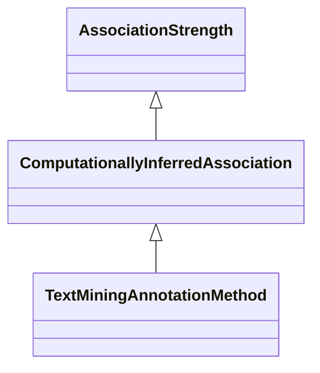

# Class: Computationally-Inferred Association (ComputationallyInferredAssociation) 


_associations that were inferred with computational methods such as text mining or knowledge_

_graph analysis. This includes methods that are primarily based on knowledge and semantics_

_analysis, eg, text mining. We classify other methods, such as homology or gene-set enrichment_

_analysis, under biological topic._

__

_TODO: vague definition, requires clarification. The initial reason to have this class was_

_to establish that text mining has less strength than manual annotation, but maybe we could_

_remove it and go with `associationStrength`. _

__


* __NOTE__: this is an abstract class and should not be instantiated directly


URI: [motif:ComputationallyInferredAssociation](https://knetminer.com/terms/motifs/motif-categories/ComputationallyInferredAssociation)





## Inheritance
* [SemanticMotifCategory](SemanticMotifCategory.md)
    * [AssociationStrength](AssociationStrength.md)
        * **ComputationallyInferredAssociation**


## Slots

| Name | Cardinality and Range | Description | Inheritance |
| ---  | --- | --- | --- |


## Mixin Usage

| mixed into | description |
| --- | --- |
| [TextMiningAnnotationMethod](TextMiningAnnotationMethod.md) | An association that was computed via text mining methods, such as name-entity... |


## Identifier and Mapping Information


### Schema Source


* from schema: https://knetminer.com/terms/motifs/motif-categories/schema


## Mappings

| Mapping Type | Mapped Value |
| ---  | ---  |
| self | motif:ComputationallyInferredAssociation |
| native | motif:ComputationallyInferredAssociation |


## LinkML Source

<!-- TODO: investigate https://stackoverflow.com/questions/37606292/how-to-create-tabbed-code-blocks-in-mkdocs-or-sphinx -->

### Direct

<details>
```yaml
name: ComputationallyInferredAssociation
description: "associations that were inferred with computational methods such as text\
  \ mining or knowledge\ngraph analysis. This includes methods that are primarily\
  \ based on knowledge and semantics\nanalysis, eg, text mining. We classify other\
  \ methods, such as homology or gene-set enrichment\nanalysis, under biological topic.\n\
  \nTODO: vague definition, requires clarification. The initial reason to have this\
  \ class was\nto establish that text mining has less strength than manual annotation,\
  \ but maybe we could\nremove it and go with `associationStrength`. \n"
title: Computationally-Inferred Association
from_schema: https://knetminer.com/terms/motifs/motif-categories/schema
is_a: AssociationStrength
abstract: true
mixin: true

```
</details>

### Induced

<details>
```yaml
name: ComputationallyInferredAssociation
description: "associations that were inferred with computational methods such as text\
  \ mining or knowledge\ngraph analysis. This includes methods that are primarily\
  \ based on knowledge and semantics\nanalysis, eg, text mining. We classify other\
  \ methods, such as homology or gene-set enrichment\nanalysis, under biological topic.\n\
  \nTODO: vague definition, requires clarification. The initial reason to have this\
  \ class was\nto establish that text mining has less strength than manual annotation,\
  \ but maybe we could\nremove it and go with `associationStrength`. \n"
title: Computationally-Inferred Association
from_schema: https://knetminer.com/terms/motifs/motif-categories/schema
is_a: AssociationStrength
abstract: true
mixin: true

```
</details>