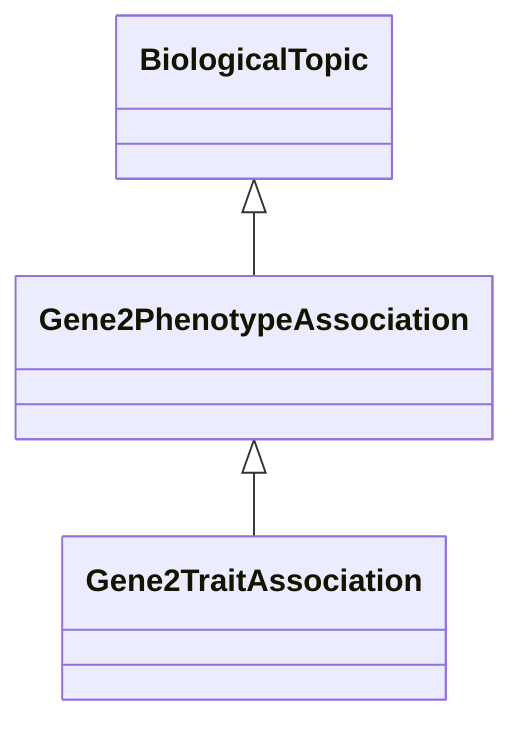

# Class: Gene-Phenotype Association (Gene2PhenotypeAssociation) 


_A causal association between a gene or gene variants and a phenotype it determines or influences._

__


* __NOTE__: this is an abstract class and should not be instantiated directly


URI: [motif:Gene2PhenotypeAssociation](https://knetminer.com/terms/motifs/motif-categories/Gene2PhenotypeAssociation)





## Inheritance
* [SemanticMotifCategory](SemanticMotifCategory.md)
    * [BiologicalTopic](BiologicalTopic.md)
        * **Gene2PhenotypeAssociation**
            * [Gene2TraitAssociation](Gene2TraitAssociation.md)


## Slots

| Name | Cardinality and Range | Description | Inheritance |
| ---  | --- | --- | --- |


## Identifier and Mapping Information


### Schema Source


* from schema: https://knetminer.com/terms/motifs/motif-categories/schema


## Mappings

| Mapping Type | Mapped Value |
| ---  | ---  |
| self | motif:Gene2PhenotypeAssociation |
| native | motif:Gene2PhenotypeAssociation |


## LinkML Source

<!-- TODO: investigate https://stackoverflow.com/questions/37606292/how-to-create-tabbed-code-blocks-in-mkdocs-or-sphinx -->

### Direct

<details>
```yaml
name: Gene2PhenotypeAssociation
description: 'A causal association between a gene or gene variants and a phenotype
  it determines or influences.

  '
title: Gene-Phenotype Association
notes:
- Initially, we only had gene/trait association, this superclass was added in case
  we want to make a distinction between the two and for the possibility that we have
  other types of phenotypic characterisation.
from_schema: https://knetminer.com/terms/motifs/motif-categories/schema
is_a: BiologicalTopic
abstract: true

```
</details>

### Induced

<details>
```yaml
name: Gene2PhenotypeAssociation
description: 'A causal association between a gene or gene variants and a phenotype
  it determines or influences.

  '
title: Gene-Phenotype Association
notes:
- Initially, we only had gene/trait association, this superclass was added in case
  we want to make a distinction between the two and for the possibility that we have
  other types of phenotypic characterisation.
from_schema: https://knetminer.com/terms/motifs/motif-categories/schema
is_a: BiologicalTopic
abstract: true

```
</details>