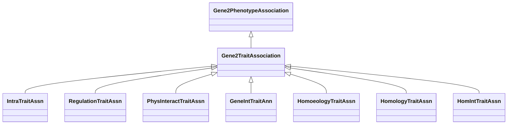

# Class: Gene-Trait Association (Gene2TraitAssociation) 


_A causal association between a gene or gene variants and a trait it determines or influences._

_This is usually used to subclass some other category to state that_

_the trait association results from the application of some method (eg, text mining, homology)._

__


* __NOTE__: this is an abstract class and should not be instantiated directly


URI: [motif:Gene2TraitAssociation](https://knetminer.com/terms/motifs/motif-categories/Gene2TraitAssociation)





## Inheritance
* [SemanticMotifCategory](SemanticMotifCategory.md)
    * [BiologicalTopic](BiologicalTopic.md)
        * [Gene2PhenotypeAssociation](Gene2PhenotypeAssociation.md)
            * **Gene2TraitAssociation**
                * [IntraTraitAssn](IntraTraitAssn.md) [ [IntraSpecieAssociation](IntraSpecieAssociation.md)]


## Slots

| Name | Cardinality and Range | Description | Inheritance |
| ---  | --- | --- | --- |


## Mixin Usage

| mixed into | description |
| --- | --- |
| [RegulationTraitAssn](RegulationTraitAssn.md) | A gene-to-trait association based on gene expression regulation |
| [PhysInteractTraitAssn](PhysInteractTraitAssn.md) | A gene-to-trait association based on physical interaction |
| [GeneIntTraitAnn](GeneIntTraitAnn.md) | A gene-to-trait association based on gene-gene interaction |
| [HomoeologyTraitAssn](HomoeologyTraitAssn.md) | A gene-to-trait association based on homoeology |
| [HomologyTraitAssn](HomologyTraitAssn.md) | A gene-to-trait association based on homology |
| [HomIntTraitAssn](HomIntTraitAssn.md) | A gene-to-trait association based on homology |


## Identifier and Mapping Information


### Schema Source


* from schema: https://knetminer.com/terms/motifs/motif-categories/schema


## Mappings

| Mapping Type | Mapped Value |
| ---  | ---  |
| self | motif:Gene2TraitAssociation |
| native | motif:Gene2TraitAssociation |


## LinkML Source

<!-- TODO: investigate https://stackoverflow.com/questions/37606292/how-to-create-tabbed-code-blocks-in-mkdocs-or-sphinx -->

### Direct

<details>
```yaml
name: Gene2TraitAssociation
description: 'A causal association between a gene or gene variants and a trait it
  determines or influences.

  This is usually used to subclass some other category to state that

  the trait association results from the application of some method (eg, text mining,
  homology).

  '
title: Gene-Trait Association
from_schema: https://knetminer.com/terms/motifs/motif-categories/schema
is_a: Gene2PhenotypeAssociation
abstract: true
mixin: true

```
</details>

### Induced

<details>
```yaml
name: Gene2TraitAssociation
description: 'A causal association between a gene or gene variants and a trait it
  determines or influences.

  This is usually used to subclass some other category to state that

  the trait association results from the application of some method (eg, text mining,
  homology).

  '
title: Gene-Trait Association
from_schema: https://knetminer.com/terms/motifs/motif-categories/schema
is_a: Gene2PhenotypeAssociation
abstract: true
mixin: true

```
</details>