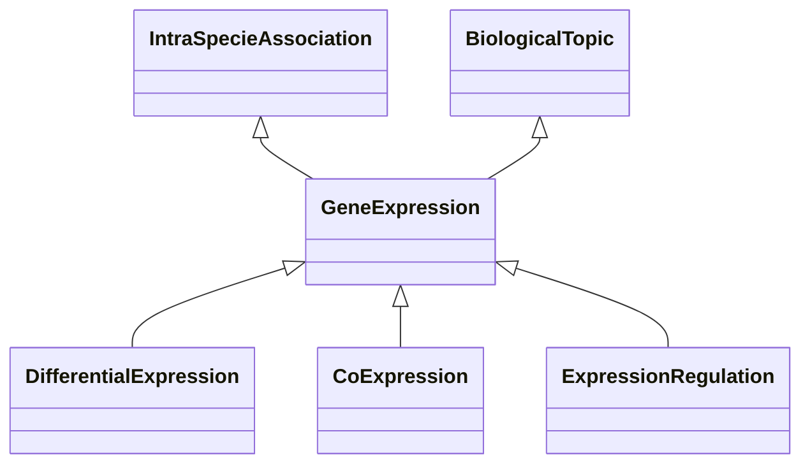

# Class: Gene Expression-Related Association (GeneExpression) 


_Associations of this type are related to gene expression, for instance because it's the mean used_

_to predict the function of a gene._

__


* __NOTE__: this is an abstract class and should not be instantiated directly


URI: [motif:GeneExpression](https://knetminer.com/terms/motifs/motif-categories/GeneExpression)





## Inheritance
* [SemanticMotifCategory](SemanticMotifCategory.md)
    * [BiologicalTopic](BiologicalTopic.md)
        * **GeneExpression** [ [IntraSpecieAssociation](IntraSpecieAssociation.md)]
            * [DifferentialExpression](DifferentialExpression.md)
            * [CoExpression](CoExpression.md)
            * [ExpressionRegulation](ExpressionRegulation.md)


## Slots

| Name | Cardinality and Range | Description | Inheritance |
| ---  | --- | --- | --- |


## Identifier and Mapping Information


### Schema Source


* from schema: https://knetminer.com/terms/motifs/motif-categories/schema


## Mappings

| Mapping Type | Mapped Value |
| ---  | ---  |
| self | motif:GeneExpression |
| native | motif:GeneExpression |


## LinkML Source

<!-- TODO: investigate https://stackoverflow.com/questions/37606292/how-to-create-tabbed-code-blocks-in-mkdocs-or-sphinx -->

### Direct

<details>
```yaml
name: GeneExpression
description: 'Associations of this type are related to gene expression, for instance
  because it''s the mean used

  to predict the function of a gene.

  '
title: Gene Expression-Related Association
from_schema: https://knetminer.com/terms/motifs/motif-categories/schema
is_a: BiologicalTopic
abstract: true
mixins:
- IntraSpecieAssociation

```
</details>

### Induced

<details>
```yaml
name: GeneExpression
description: 'Associations of this type are related to gene expression, for instance
  because it''s the mean used

  to predict the function of a gene.

  '
title: Gene Expression-Related Association
from_schema: https://knetminer.com/terms/motifs/motif-categories/schema
is_a: BiologicalTopic
abstract: true
mixins:
- IntraSpecieAssociation

```
</details>