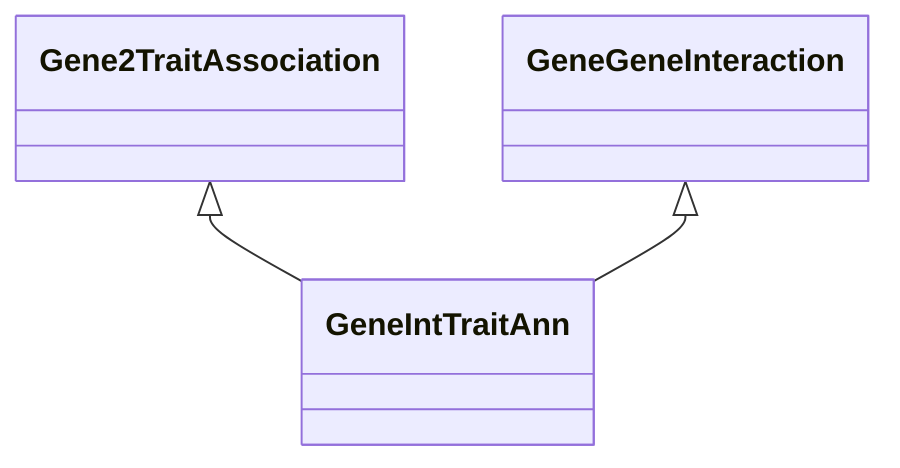

# Class: Gene-to-Trait Association via Gene-Gene Interaction (GeneIntTraitAnn) 


_A gene-to-trait association based on gene-gene interaction._

__


URI: [motif:GeneIntTraitAnn](https://knetminer.com/terms/motifs/motif-categories/GeneIntTraitAnn)





## Inheritance
* [SemanticMotifCategory](SemanticMotifCategory.md)
    * [BiologicalTopic](BiologicalTopic.md)
        * [GeneGeneInteraction](GeneGeneInteraction.md)
            * **GeneIntTraitAnn** [ [Gene2TraitAssociation](Gene2TraitAssociation.md)]


## Slots

| Name | Cardinality and Range | Description | Inheritance |
| ---  | --- | --- | --- |


## Identifier and Mapping Information


### Annotations

| property | value |
| --- | --- |
| originalCategory | interaction::genetic::genetics |


### Schema Source


* from schema: https://knetminer.com/terms/motifs/motif-categories/schema


## Mappings

| Mapping Type | Mapped Value |
| ---  | ---  |
| self | motif:GeneIntTraitAnn |
| native | motif:GeneIntTraitAnn |


## LinkML Source

<!-- TODO: investigate https://stackoverflow.com/questions/37606292/how-to-create-tabbed-code-blocks-in-mkdocs-or-sphinx -->

### Direct

<details>
```yaml
name: GeneIntTraitAnn
annotations:
  originalCategory:
    tag: originalCategory
    value: interaction::genetic::genetics
description: 'A gene-to-trait association based on gene-gene interaction.

  '
title: Gene-to-Trait Association via Gene-Gene Interaction
notes:
- 'original category no: 2.10'
from_schema: https://knetminer.com/terms/motifs/motif-categories/schema
is_a: GeneGeneInteraction
mixins:
- Gene2TraitAssociation

```
</details>

### Induced

<details>
```yaml
name: GeneIntTraitAnn
annotations:
  originalCategory:
    tag: originalCategory
    value: interaction::genetic::genetics
description: 'A gene-to-trait association based on gene-gene interaction.

  '
title: Gene-to-Trait Association via Gene-Gene Interaction
notes:
- 'original category no: 2.10'
from_schema: https://knetminer.com/terms/motifs/motif-categories/schema
is_a: GeneGeneInteraction
mixins:
- Gene2TraitAssociation

```
</details>