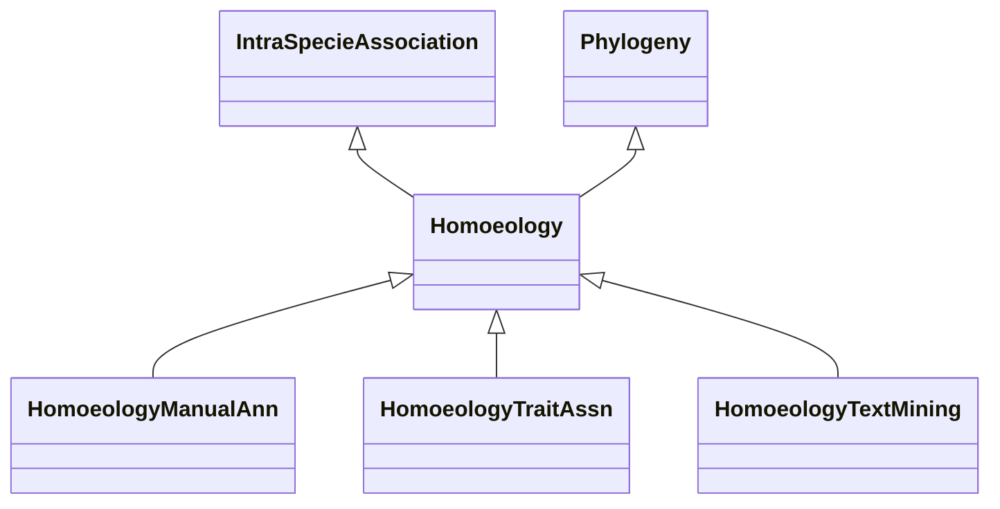

# Class: Homoeology-related Association (Homoeology) 


_Associations related to homoeology. Homoeologs are pairs of genes that originated by speciation _

_and were brought back together in the same genome by allopolyploidization (PMC4920642)._

__

_Allopolyploidization is the formation of new species through the combination of chromosomes from_

_different species._

__

_Based on the meaning of the term, this class is made a subclass of 'IntraSpecieAssociation'._

__


* __NOTE__: this is an abstract class and should not be instantiated directly


URI: [motif:Homoeology](https://knetminer.com/terms/motifs/motif-categories/Homoeology)





## Inheritance
* [SemanticMotifCategory](SemanticMotifCategory.md)
    * [BiologicalTopic](BiologicalTopic.md)
        * [Phylogeny](Phylogeny.md)
            * **Homoeology** [ [IntraSpecieAssociation](IntraSpecieAssociation.md)]
                * [HomoeologyManualAnn](HomoeologyManualAnn.md) [ [ManualAnnotationMethod](ManualAnnotationMethod.md)]
                * [HomoeologyTraitAssn](HomoeologyTraitAssn.md) [ [Gene2TraitAssociation](Gene2TraitAssociation.md)]
                * [HomoeologyTextMining](HomoeologyTextMining.md) [ [TextMiningAnnotationMethod](TextMiningAnnotationMethod.md)]


## Slots

| Name | Cardinality and Range | Description | Inheritance |
| ---  | --- | --- | --- |


## Identifier and Mapping Information


### Annotations

| property | value |
| --- | --- |
| associationStrength | 3.1 |


### Schema Source


* from schema: https://knetminer.com/terms/motifs/motif-categories/schema


## Mappings

| Mapping Type | Mapped Value |
| ---  | ---  |
| self | motif:Homoeology |
| native | motif:Homoeology |


## LinkML Source

<!-- TODO: investigate https://stackoverflow.com/questions/37606292/how-to-create-tabbed-code-blocks-in-mkdocs-or-sphinx -->

### Direct

<details>
```yaml
name: Homoeology
annotations:
  associationStrength:
    tag: associationStrength
    value: 3.1
description: "Associations related to homoeology. Homoeologs are pairs of genes that\
  \ originated by speciation \nand were brought back together in the same genome by\
  \ allopolyploidization (PMC4920642).\n\nAllopolyploidization is the formation of\
  \ new species through the combination of chromosomes from\ndifferent species.\n\n\
  Based on the meaning of the term, this class is made a subclass of 'IntraSpecieAssociation'.\n"
title: Homoeology-related Association
from_schema: https://knetminer.com/terms/motifs/motif-categories/schema
is_a: Phylogeny
abstract: true
mixins:
- IntraSpecieAssociation

```
</details>

### Induced

<details>
```yaml
name: Homoeology
annotations:
  associationStrength:
    tag: associationStrength
    value: 3.1
description: "Associations related to homoeology. Homoeologs are pairs of genes that\
  \ originated by speciation \nand were brought back together in the same genome by\
  \ allopolyploidization (PMC4920642).\n\nAllopolyploidization is the formation of\
  \ new species through the combination of chromosomes from\ndifferent species.\n\n\
  Based on the meaning of the term, this class is made a subclass of 'IntraSpecieAssociation'.\n"
title: Homoeology-related Association
from_schema: https://knetminer.com/terms/motifs/motif-categories/schema
is_a: Phylogeny
abstract: true
mixins:
- IntraSpecieAssociation

```
</details>