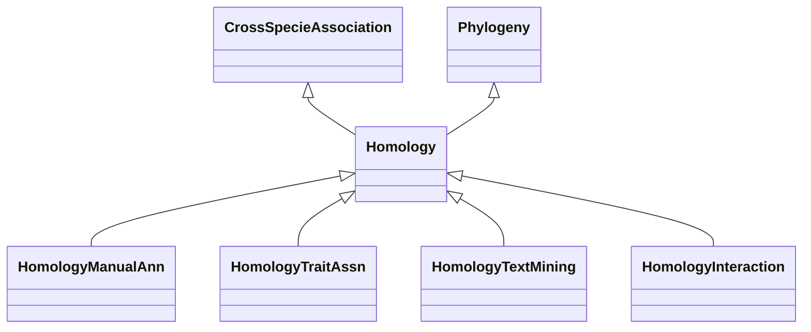

# Class: Homology-related Association (Homology) 


_Associations related to homology, that it, cross-specie gene similarity resulting from _

_shared ancestry._

_Based on the meaning of this term, this class is made a subclass of 'CrossSpecieAssociation'._

__


* __NOTE__: this is an abstract class and should not be instantiated directly


URI: [motif:Homology](https://knetminer.com/terms/motifs/motif-categories/Homology)





## Inheritance
* [SemanticMotifCategory](SemanticMotifCategory.md)
    * [BiologicalTopic](BiologicalTopic.md)
        * [Phylogeny](Phylogeny.md)
            * **Homology** [ [CrossSpecieAssociation](CrossSpecieAssociation.md)]
                * [HomologyManualAnn](HomologyManualAnn.md) [ [ManualAnnotationMethod](ManualAnnotationMethod.md)]
                * [HomologyTraitAssn](HomologyTraitAssn.md) [ [Gene2TraitAssociation](Gene2TraitAssociation.md)]
                * [HomologyTextMining](HomologyTextMining.md) [ [TextMiningAnnotationMethod](TextMiningAnnotationMethod.md)]
                * [HomologyInteraction](HomologyInteraction.md)


## Slots

| Name | Cardinality and Range | Description | Inheritance |
| ---  | --- | --- | --- |


## Identifier and Mapping Information


### Annotations

| property | value |
| --- | --- |
| associationStrength | 3.2 |


### Schema Source


* from schema: https://knetminer.com/terms/motifs/motif-categories/schema


## Mappings

| Mapping Type | Mapped Value |
| ---  | ---  |
| self | motif:Homology |
| native | motif:Homology |


## LinkML Source

<!-- TODO: investigate https://stackoverflow.com/questions/37606292/how-to-create-tabbed-code-blocks-in-mkdocs-or-sphinx -->

### Direct

<details>
```yaml
name: Homology
annotations:
  associationStrength:
    tag: associationStrength
    value: 3.2
description: "Associations related to homology, that it, cross-specie gene similarity\
  \ resulting from \nshared ancestry.\nBased on the meaning of this term, this class\
  \ is made a subclass of 'CrossSpecieAssociation'.\n"
title: Homology-related Association
from_schema: https://knetminer.com/terms/motifs/motif-categories/schema
is_a: Phylogeny
abstract: true
mixins:
- CrossSpecieAssociation

```
</details>

### Induced

<details>
```yaml
name: Homology
annotations:
  associationStrength:
    tag: associationStrength
    value: 3.2
description: "Associations related to homology, that it, cross-specie gene similarity\
  \ resulting from \nshared ancestry.\nBased on the meaning of this term, this class\
  \ is made a subclass of 'CrossSpecieAssociation'.\n"
title: Homology-related Association
from_schema: https://knetminer.com/terms/motifs/motif-categories/schema
is_a: Phylogeny
abstract: true
mixins:
- CrossSpecieAssociation

```
</details>