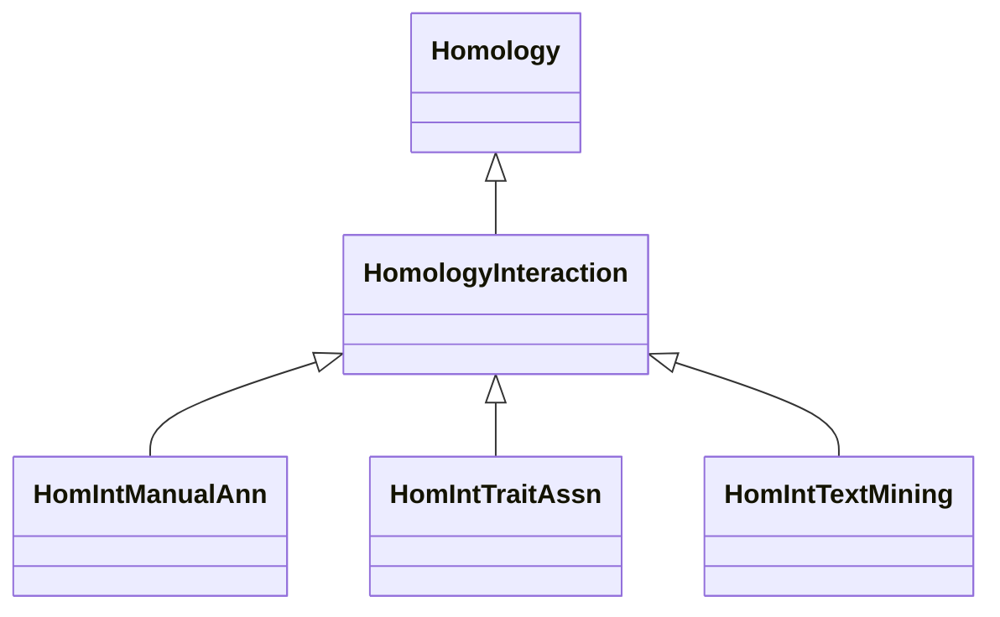

# Class: Association about Homology Interaction (HomologyInteraction) 


_These paths rely on a multi-step hypothesis that assumes a protein-protein interaction is _

_conserved across species, adding a significant layer of uncertainty._

__


* __NOTE__: this is an abstract class and should not be instantiated directly


URI: [motif:HomologyInteraction](https://knetminer.com/terms/motifs/motif-categories/HomologyInteraction)





## Inheritance
* [SemanticMotifCategory](SemanticMotifCategory.md)
    * [BiologicalTopic](BiologicalTopic.md)
        * [Phylogeny](Phylogeny.md)
            * [Homology](Homology.md) [ [CrossSpecieAssociation](CrossSpecieAssociation.md)]
                * **HomologyInteraction**
                    * [HomIntManualAnn](HomIntManualAnn.md) [ [ManualAnnotationMethod](ManualAnnotationMethod.md)]
                    * [HomIntTraitAssn](HomIntTraitAssn.md) [ [Gene2TraitAssociation](Gene2TraitAssociation.md)]
                    * [HomIntTextMining](HomIntTextMining.md) [ [TextMiningAnnotationMethod](TextMiningAnnotationMethod.md)]


## Slots

| Name | Cardinality and Range | Description | Inheritance |
| ---  | --- | --- | --- |


## Identifier and Mapping Information


### Annotations

| property | value |
| --- | --- |
| associationStrength | 5 |


### Schema Source


* from schema: https://knetminer.com/terms/motifs/motif-categories/schema


## Mappings

| Mapping Type | Mapped Value |
| ---  | ---  |
| self | motif:HomologyInteraction |
| native | motif:HomologyInteraction |


## LinkML Source

<!-- TODO: investigate https://stackoverflow.com/questions/37606292/how-to-create-tabbed-code-blocks-in-mkdocs-or-sphinx -->

### Direct

<details>
```yaml
name: HomologyInteraction
annotations:
  associationStrength:
    tag: associationStrength
    value: 5
description: "These paths rely on a multi-step hypothesis that assumes a protein-protein\
  \ interaction is \nconserved across species, adding a significant layer of uncertainty.\n"
title: Association about Homology Interaction
notes:
- 'original category no: Tier 5'
from_schema: https://knetminer.com/terms/motifs/motif-categories/schema
is_a: Homology
abstract: true

```
</details>

### Induced

<details>
```yaml
name: HomologyInteraction
annotations:
  associationStrength:
    tag: associationStrength
    value: 5
description: "These paths rely on a multi-step hypothesis that assumes a protein-protein\
  \ interaction is \nconserved across species, adding a significant layer of uncertainty.\n"
title: Association about Homology Interaction
notes:
- 'original category no: Tier 5'
from_schema: https://knetminer.com/terms/motifs/motif-categories/schema
is_a: Homology
abstract: true

```
</details>