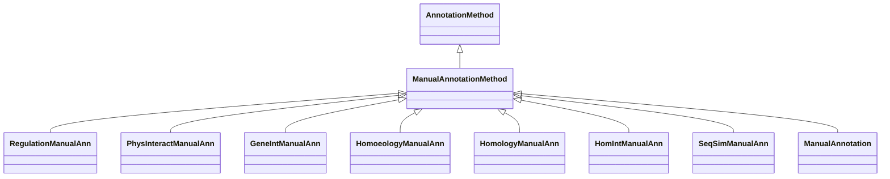

# Class: Manual Annotation Method (ManualAnnotationMethod) 


_An association category that represents a manual annotation, provided by a curator or expert._

__

_Note that this is the abstract category used to derive concrete/instantiantable categories_

_that imply the use of this annotation method. Use `ManualAnnotation` to associate a semantic _

_motif to a manual annotation._

__


* __NOTE__: this is an abstract class and should not be instantiated directly


URI: [motif:ManualAnnotationMethod](https://knetminer.com/terms/motifs/motif-categories/ManualAnnotationMethod)





## Inheritance
* [SemanticMotifCategory](SemanticMotifCategory.md)
    * [AnnotationMethod](AnnotationMethod.md)
        * **ManualAnnotationMethod**


## Slots

| Name | Cardinality and Range | Description | Inheritance |
| ---  | --- | --- | --- |


## Mixin Usage

| mixed into | description |
| --- | --- |
| [RegulationManualAnn](RegulationManualAnn.md) | An association that represents a manual annotation based on gene expression r... |
| [PhysInteractManualAnn](PhysInteractManualAnn.md) | An association that represents a manual annotation based on physical interact... |
| [GeneIntManualAnn](GeneIntManualAnn.md) | An association that represents a manual annotation based on gene-gene interac... |
| [HomoeologyManualAnn](HomoeologyManualAnn.md) | An association that represents a manual annotation based on homoeology |
| [HomologyManualAnn](HomologyManualAnn.md) | An association that represents a manual annotation based on homology |
| [HomIntManualAnn](HomIntManualAnn.md) | An association that represents a manual annotation based on homology interact... |
| [SeqSimManualAnn](SeqSimManualAnn.md) | An association that represents a manual annotation based on sequence similari... |
| [ManualAnnotation](ManualAnnotation.md) | An association category that represents a manual annotation, provided by a cu... |


## Identifier and Mapping Information


### Schema Source


* from schema: https://knetminer.com/terms/motifs/motif-categories/schema


## Mappings

| Mapping Type | Mapped Value |
| ---  | ---  |
| self | motif:ManualAnnotationMethod |
| native | motif:ManualAnnotationMethod |


## LinkML Source

<!-- TODO: investigate https://stackoverflow.com/questions/37606292/how-to-create-tabbed-code-blocks-in-mkdocs-or-sphinx -->

### Direct

<details>
```yaml
name: ManualAnnotationMethod
description: "An association category that represents a manual annotation, provided\
  \ by a curator or expert.\n\nNote that this is the abstract category used to derive\
  \ concrete/instantiantable categories\nthat imply the use of this annotation method.\
  \ Use `ManualAnnotation` to associate a semantic \nmotif to a manual annotation.\n"
title: Manual Annotation Method
from_schema: https://knetminer.com/terms/motifs/motif-categories/schema
is_a: AnnotationMethod
abstract: true
mixin: true

```
</details>

### Induced

<details>
```yaml
name: ManualAnnotationMethod
description: "An association category that represents a manual annotation, provided\
  \ by a curator or expert.\n\nNote that this is the abstract category used to derive\
  \ concrete/instantiantable categories\nthat imply the use of this annotation method.\
  \ Use `ManualAnnotation` to associate a semantic \nmotif to a manual annotation.\n"
title: Manual Annotation Method
from_schema: https://knetminer.com/terms/motifs/motif-categories/schema
is_a: AnnotationMethod
abstract: true
mixin: true

```
</details>