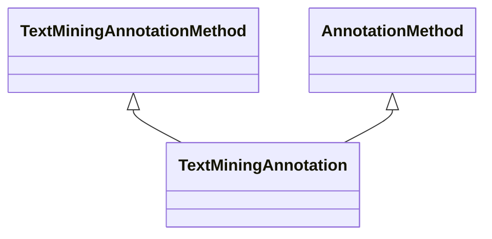

# Class: Text Mining Annotation (TextMiningAnnotation) 


_An association that was computed via text mining methods, such as name-entity recognition,_

_semantic similarity or LLM-based embeddings._

__


URI: [motif:TextMiningAnnotation](https://knetminer.com/terms/motifs/motif-categories/TextMiningAnnotation)





## Inheritance
* [SemanticMotifCategory](SemanticMotifCategory.md)
    * [AnnotationMethod](AnnotationMethod.md)
        * **TextMiningAnnotation** [ [TextMiningAnnotationMethod](TextMiningAnnotationMethod.md)]


## Slots

| Name | Cardinality and Range | Description | Inheritance |
| ---  | --- | --- | --- |


## Identifier and Mapping Information


### Annotations

| property | value |
| --- | --- |
| originalCategory | direct::literature |


### Schema Source


* from schema: https://knetminer.com/terms/motifs/motif-categories/schema


## Mappings

| Mapping Type | Mapped Value |
| ---  | ---  |
| self | motif:TextMiningAnnotation |
| native | motif:TextMiningAnnotation |


## LinkML Source

<!-- TODO: investigate https://stackoverflow.com/questions/37606292/how-to-create-tabbed-code-blocks-in-mkdocs-or-sphinx -->

### Direct

<details>
```yaml
name: TextMiningAnnotation
annotations:
  originalCategory:
    tag: originalCategory
    value: direct::literature
description: 'An association that was computed via text mining methods, such as name-entity
  recognition,

  semantic similarity or LLM-based embeddings.

  '
title: Text Mining Annotation
notes:
- 'original category no: 1.2'
from_schema: https://knetminer.com/terms/motifs/motif-categories/schema
is_a: AnnotationMethod
mixins:
- TextMiningAnnotationMethod

```
</details>

### Induced

<details>
```yaml
name: TextMiningAnnotation
annotations:
  originalCategory:
    tag: originalCategory
    value: direct::literature
description: 'An association that was computed via text mining methods, such as name-entity
  recognition,

  semantic similarity or LLM-based embeddings.

  '
title: Text Mining Annotation
notes:
- 'original category no: 1.2'
from_schema: https://knetminer.com/terms/motifs/motif-categories/schema
is_a: AnnotationMethod
mixins:
- TextMiningAnnotationMethod

```
</details>