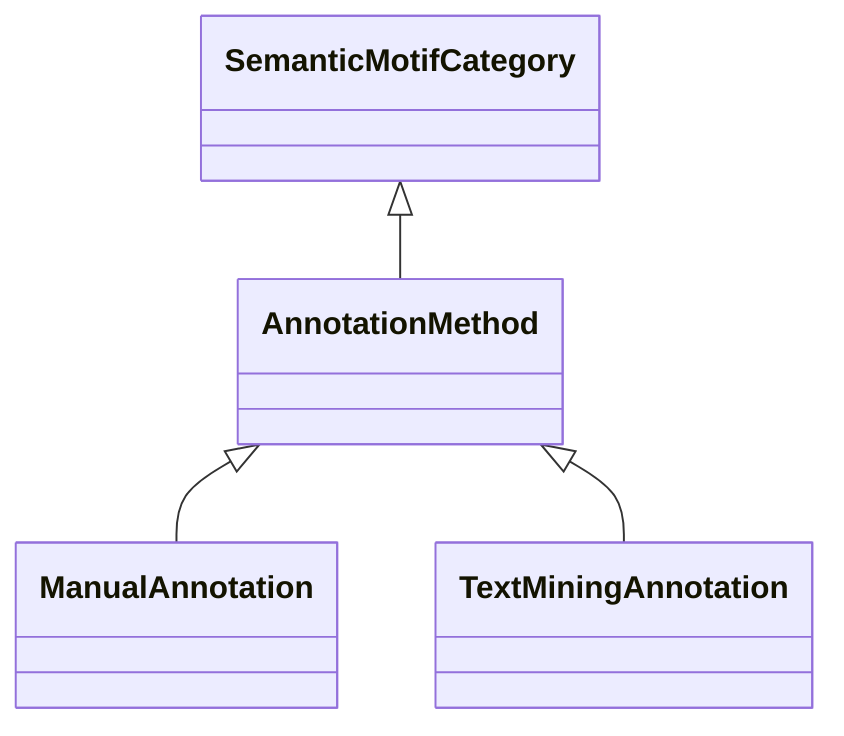

# Class: Annotation Method (AnnotationMethod) 


_Categories under this branch are used to qualify semantic motif associations according to the_

_method used to establish the association, such as manual annotation or text mining._

__


* __NOTE__: this is an abstract class and should not be instantiated directly


URI: [motif:AnnotationMethod](https://knetminer.com/terms/motifs/motif-categories/AnnotationMethod)





## Inheritance
* [SemanticMotifCategory](SemanticMotifCategory.md)
    * **AnnotationMethod**
        * [ManualAnnotation](ManualAnnotation.md)
        * [TextMiningAnnotation](TextMiningAnnotation.md) [ [ComputationallyInferredAssociation](ComputationallyInferredAssociation.md)]


## Slots

| Name | Cardinality and Range | Description | Inheritance |
| ---  | --- | --- | --- |


## Identifier and Mapping Information


### Schema Source


* from schema: https://knetminer.com/terms/motifs/motif-categories/schema


## Mappings

| Mapping Type | Mapped Value |
| ---  | ---  |
| self | motif:AnnotationMethod |
| native | motif:AnnotationMethod |


## LinkML Source

<!-- TODO: investigate https://stackoverflow.com/questions/37606292/how-to-create-tabbed-code-blocks-in-mkdocs-or-sphinx -->

### Direct

<details>
```yaml
name: AnnotationMethod
description: 'Categories under this branch are used to qualify semantic motif associations
  according to the

  method used to establish the association, such as manual annotation or text mining.

  '
title: Annotation Method
from_schema: https://knetminer.com/terms/motifs/motif-categories/schema
is_a: SemanticMotifCategory
abstract: true

```
</details>

### Induced

<details>
```yaml
name: AnnotationMethod
description: 'Categories under this branch are used to qualify semantic motif associations
  according to the

  method used to establish the association, such as manual annotation or text mining.

  '
title: Annotation Method
from_schema: https://knetminer.com/terms/motifs/motif-categories/schema
is_a: SemanticMotifCategory
abstract: true

```
</details>