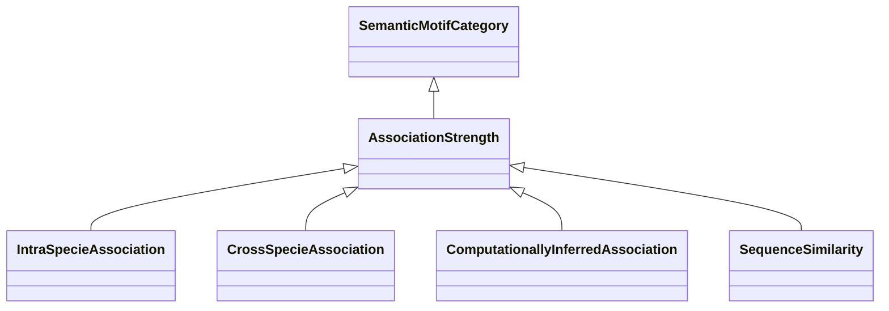

# Class: Association Strength (AssociationStrength) 


_This branch classifies categories according to the strenght/reliability/significance/etc of the_

_gene/concept associations._

__

_We use the annotation 'associationStrength' to assign a strength number to categories that are _

_related to the strength of an association. This value is intended to be inherited by subclasses_

_of an ancestor that defines it, and of course it can be overriden by the subclasses._

__


* __NOTE__: this is an abstract class and should not be instantiated directly


URI: [motif:AssociationStrength](https://knetminer.com/terms/motifs/motif-categories/AssociationStrength)





## Inheritance
* [SemanticMotifCategory](SemanticMotifCategory.md)
    * **AssociationStrength**
        * [IntraSpecieAssociation](IntraSpecieAssociation.md)
        * [CrossSpecieAssociation](CrossSpecieAssociation.md)
        * [ComputationallyInferredAssociation](ComputationallyInferredAssociation.md)


## Slots

| Name | Cardinality and Range | Description | Inheritance |
| ---  | --- | --- | --- |


## Identifier and Mapping Information


### Schema Source


* from schema: https://knetminer.com/terms/motifs/motif-categories/schema


## Mappings

| Mapping Type | Mapped Value |
| ---  | ---  |
| self | motif:AssociationStrength |
| native | motif:AssociationStrength |


## LinkML Source

<!-- TODO: investigate https://stackoverflow.com/questions/37606292/how-to-create-tabbed-code-blocks-in-mkdocs-or-sphinx -->

### Direct

<details>
```yaml
name: AssociationStrength
description: "This branch classifies categories according to the strenght/reliability/significance/etc\
  \ of the\ngene/concept associations.\n\nWe use the annotation 'associationStrength'\
  \ to assign a strength number to categories that are \nrelated to the strength of\
  \ an association. This value is intended to be inherited by subclasses\nof an ancestor\
  \ that defines it, and of course it can be overriden by the subclasses.\n"
title: Association Strength
from_schema: https://knetminer.com/terms/motifs/motif-categories/schema
is_a: SemanticMotifCategory
abstract: true

```
</details>

### Induced

<details>
```yaml
name: AssociationStrength
description: "This branch classifies categories according to the strenght/reliability/significance/etc\
  \ of the\ngene/concept associations.\n\nWe use the annotation 'associationStrength'\
  \ to assign a strength number to categories that are \nrelated to the strength of\
  \ an association. This value is intended to be inherited by subclasses\nof an ancestor\
  \ that defines it, and of course it can be overriden by the subclasses.\n"
title: Association Strength
from_schema: https://knetminer.com/terms/motifs/motif-categories/schema
is_a: SemanticMotifCategory
abstract: true

```
</details>