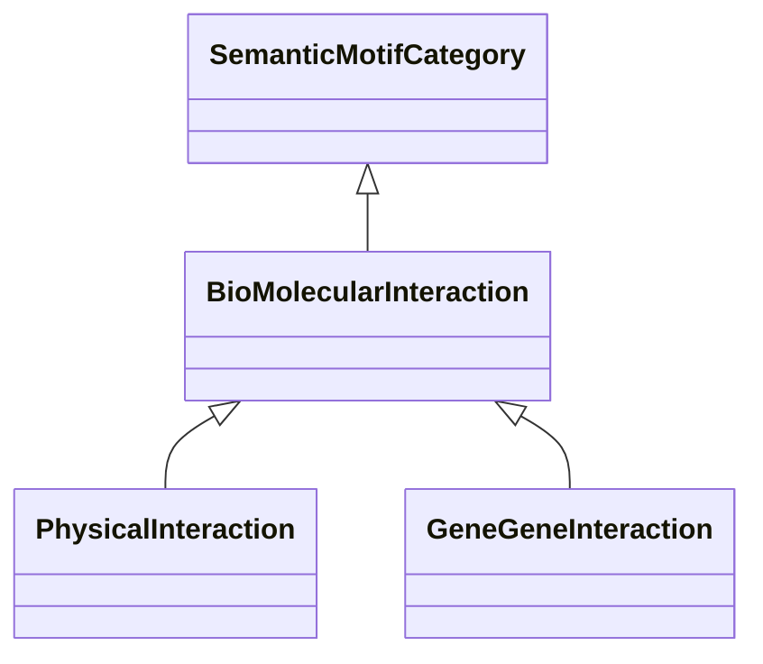

# Class: Bio-Molecular Interaction (BioMolecularInteraction) 


_Bio-molecular interactions between genes or between genes and other entities._

__


* __NOTE__: this is an abstract class and should not be instantiated directly


URI: [motif:BioMolecularInteraction](https://knetminer.com/terms/motifs/motif-categories/BioMolecularInteraction)





## Inheritance
* [SemanticMotifCategory](SemanticMotifCategory.md)
    * **BioMolecularInteraction**
        * [PhysicalInteraction](PhysicalInteraction.md)
        * [GeneGeneInteraction](GeneGeneInteraction.md)


## Slots

| Name | Cardinality and Range | Description | Inheritance |
| ---  | --- | --- | --- |


## Identifier and Mapping Information


### Schema Source


* from schema: https://knetminer.com/terms/motifs/motif-categories/schema


## Mappings

| Mapping Type | Mapped Value |
| ---  | ---  |
| self | motif:BioMolecularInteraction |
| native | motif:BioMolecularInteraction |


## LinkML Source

<!-- TODO: investigate https://stackoverflow.com/questions/37606292/how-to-create-tabbed-code-blocks-in-mkdocs-or-sphinx -->

### Direct

<details>
```yaml
name: BioMolecularInteraction
description: 'Bio-molecular interactions between genes or between genes and other
  entities.

  '
title: Bio-Molecular Interaction
from_schema: https://knetminer.com/terms/motifs/motif-categories/schema
is_a: SemanticMotifCategory
abstract: true

```
</details>

### Induced

<details>
```yaml
name: BioMolecularInteraction
description: 'Bio-molecular interactions between genes or between genes and other
  entities.

  '
title: Bio-Molecular Interaction
from_schema: https://knetminer.com/terms/motifs/motif-categories/schema
is_a: SemanticMotifCategory
abstract: true

```
</details>