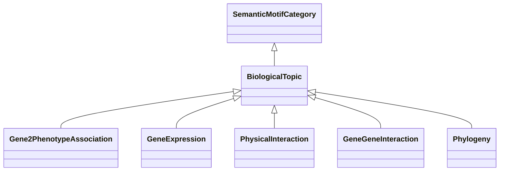

# Class: Biological Topic-based Association (BiologicalTopic) 


_Categories under this branch are used to qualify a semantic motif association with the kind of_

_biological topic, experimental method, bioinformatic evidence etc that justifies the association._

__


* __NOTE__: this is an abstract class and should not be instantiated directly


URI: [motif:BiologicalTopic](https://knetminer.com/terms/motifs/motif-categories/BiologicalTopic)





## Inheritance
* [SemanticMotifCategory](SemanticMotifCategory.md)
    * **BiologicalTopic**
        * [Gene2PhenotypeAssociation](Gene2PhenotypeAssociation.md)
        * [GeneExpression](GeneExpression.md) [ [IntraSpeciesAssociation](IntraSpeciesAssociation.md)]
        * [PhysicalInteraction](PhysicalInteraction.md)
        * [GeneGeneInteraction](GeneGeneInteraction.md)
        * [Phylogeny](Phylogeny.md)


## Slots

| Name | Cardinality and Range | Description | Inheritance |
| ---  | --- | --- | --- |


## Identifier and Mapping Information


### Schema Source


* from schema: https://knetminer.com/terms/motifs/motif-categories/schema


## Mappings

| Mapping Type | Mapped Value |
| ---  | ---  |
| self | motif:BiologicalTopic |
| native | motif:BiologicalTopic |


## LinkML Source

<!-- TODO: investigate https://stackoverflow.com/questions/37606292/how-to-create-tabbed-code-blocks-in-mkdocs-or-sphinx -->

### Direct

<details>
```yaml
name: BiologicalTopic
description: 'Categories under this branch are used to qualify a semantic motif association
  with the kind of

  biological topic, experimental method, bioinformatic evidence etc that justifies
  the association.

  '
title: Biological Topic-based Association
from_schema: https://knetminer.com/terms/motifs/motif-categories/schema
is_a: SemanticMotifCategory
abstract: true

```
</details>

### Induced

<details>
```yaml
name: BiologicalTopic
description: 'Categories under this branch are used to qualify a semantic motif association
  with the kind of

  biological topic, experimental method, bioinformatic evidence etc that justifies
  the association.

  '
title: Biological Topic-based Association
from_schema: https://knetminer.com/terms/motifs/motif-categories/schema
is_a: SemanticMotifCategory
abstract: true

```
</details>