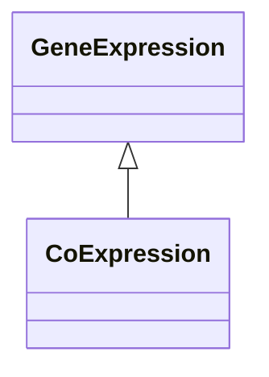

# Class: Co-expression (CoExpression) 


_A gene expression association based on the fact that two (or more genes) are similarly expressed_

_under similar conditions._

__


URI: [motif:CoExpression](https://knetminer.com/terms/motifs/motif-categories/CoExpression)





## Inheritance
* [SemanticMotifCategory](SemanticMotifCategory.md)
    * [GeneExpression](GeneExpression.md) [ [IntraSpeciesAssociation](IntraSpeciesAssociation.md)]
        * **CoExpression**


## Slots

| Name | Cardinality and Range | Description | Inheritance |
| ---  | --- | --- | --- |


## Identifier and Mapping Information


### Annotations

| property | value |
| --- | --- |
| originalCategory | expression::coexpression |


### Schema Source


* from schema: https://knetminer.com/terms/motifs/motif-categories/schema


## Mappings

| Mapping Type | Mapped Value |
| ---  | ---  |
| self | motif:CoExpression |
| native | motif:CoExpression |


## LinkML Source

<!-- TODO: investigate https://stackoverflow.com/questions/37606292/how-to-create-tabbed-code-blocks-in-mkdocs-or-sphinx -->

### Direct

<details>
```yaml
name: CoExpression
annotations:
  originalCategory:
    tag: originalCategory
    value: expression::coexpression
description: 'A gene expression association based on the fact that two (or more genes)
  are similarly expressed

  under similar conditions.

  '
title: Co-expression
notes:
- 'original category no: 2.2'
from_schema: https://knetminer.com/terms/motifs/motif-categories/schema
is_a: GeneExpression

```
</details>

### Induced

<details>
```yaml
name: CoExpression
annotations:
  originalCategory:
    tag: originalCategory
    value: expression::coexpression
description: 'A gene expression association based on the fact that two (or more genes)
  are similarly expressed

  under similar conditions.

  '
title: Co-expression
notes:
- 'original category no: 2.2'
from_schema: https://knetminer.com/terms/motifs/motif-categories/schema
is_a: GeneExpression

```
</details>