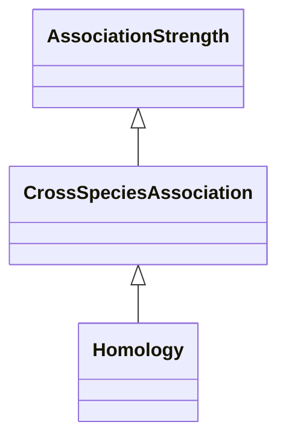

# Class: Cross-Species Association (CrossSpeciesAssociation) 


_Associations in this category are obtained by comparing information across species, eg,_

_via homology or sequence similarity.    _

__


* __NOTE__: this is an abstract class and should not be instantiated directly


URI: [motif:CrossSpeciesAssociation](https://knetminer.com/terms/motifs/motif-categories/CrossSpeciesAssociation)





## Inheritance
* [SemanticMotifCategory](SemanticMotifCategory.md)
    * [AssociationStrength](AssociationStrength.md)
        * **CrossSpeciesAssociation**


## Slots

| Name | Cardinality and Range | Description | Inheritance |
| ---  | --- | --- | --- |


## Mixin Usage

| mixed into | description |
| --- | --- |
| [Homology](Homology.md) | Associations related to homology, that it, cross-species gene similarity resu... |


## Identifier and Mapping Information


### Annotations

| property | value |
| --- | --- |
| associationStrength | 2 |


### Schema Source


* from schema: https://knetminer.com/terms/motifs/motif-categories/schema


## Mappings

| Mapping Type | Mapped Value |
| ---  | ---  |
| self | motif:CrossSpeciesAssociation |
| native | motif:CrossSpeciesAssociation |


## LinkML Source

<!-- TODO: investigate https://stackoverflow.com/questions/37606292/how-to-create-tabbed-code-blocks-in-mkdocs-or-sphinx -->

### Direct

<details>
```yaml
name: CrossSpeciesAssociation
annotations:
  associationStrength:
    tag: associationStrength
    value: 2
description: "Associations in this category are obtained by comparing information\
  \ across species, eg,\nvia homology or sequence similarity.    \n"
title: Cross-Species Association
from_schema: https://knetminer.com/terms/motifs/motif-categories/schema
is_a: AssociationStrength
abstract: true
mixin: true

```
</details>

### Induced

<details>
```yaml
name: CrossSpeciesAssociation
annotations:
  associationStrength:
    tag: associationStrength
    value: 2
description: "Associations in this category are obtained by comparing information\
  \ across species, eg,\nvia homology or sequence similarity.    \n"
title: Cross-Species Association
from_schema: https://knetminer.com/terms/motifs/motif-categories/schema
is_a: AssociationStrength
abstract: true
mixin: true

```
</details>