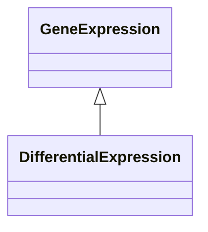

# Class: Differential Expression (DifferentialExpression) 


_A variant of the `GeneExpression` category, to specifically state that an association is based_

_of differential gene expression analysis, eg, by comparing gene expression in a treatement/control_

_experiment._

__


URI: [motif:DifferentialExpression](https://knetminer.com/terms/motifs/motif-categories/DifferentialExpression)





## Inheritance
* [SemanticMotifCategory](SemanticMotifCategory.md)
    * [GeneExpression](GeneExpression.md) [ [IntraSpeciesAssociation](IntraSpeciesAssociation.md)]
        * **DifferentialExpression**


## Slots

| Name | Cardinality and Range | Description | Inheritance |
| ---  | --- | --- | --- |


## Identifier and Mapping Information


### Annotations

| property | value |
| --- | --- |
| originalCategory | expression::differential |


### Schema Source


* from schema: https://knetminer.com/terms/motifs/motif-categories/schema


## Mappings

| Mapping Type | Mapped Value |
| ---  | ---  |
| self | motif:DifferentialExpression |
| native | motif:DifferentialExpression |


## LinkML Source

<!-- TODO: investigate https://stackoverflow.com/questions/37606292/how-to-create-tabbed-code-blocks-in-mkdocs-or-sphinx -->

### Direct

<details>
```yaml
name: DifferentialExpression
annotations:
  originalCategory:
    tag: originalCategory
    value: expression::differential
description: 'A variant of the `GeneExpression` category, to specifically state that
  an association is based

  of differential gene expression analysis, eg, by comparing gene expression in a
  treatement/control

  experiment.

  '
title: Differential Expression
notes:
- 'original category no: 2.1'
from_schema: https://knetminer.com/terms/motifs/motif-categories/schema
is_a: GeneExpression

```
</details>

### Induced

<details>
```yaml
name: DifferentialExpression
annotations:
  originalCategory:
    tag: originalCategory
    value: expression::differential
description: 'A variant of the `GeneExpression` category, to specifically state that
  an association is based

  of differential gene expression analysis, eg, by comparing gene expression in a
  treatement/control

  experiment.

  '
title: Differential Expression
notes:
- 'original category no: 2.1'
from_schema: https://knetminer.com/terms/motifs/motif-categories/schema
is_a: GeneExpression

```
</details>