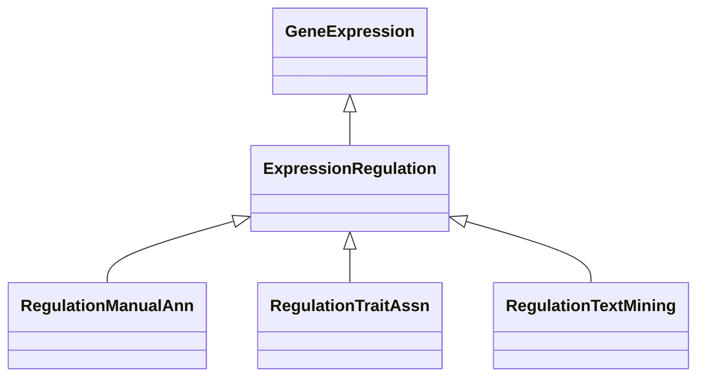

# Class: Association about Gene Expression Regulation (ExpressionRegulation) 


_Association about the regulation of the gene expression of a gene done by another gene, protein or_

_biological entity._

__


* __NOTE__: this is an abstract class and should not be instantiated directly


URI: [motif:ExpressionRegulation](https://knetminer.com/terms/motifs/motif-categories/ExpressionRegulation)





## Inheritance
* [SemanticMotifCategory](SemanticMotifCategory.md)
    * [BiologicalTopic](BiologicalTopic.md)
        * [GeneExpression](GeneExpression.md) [ [IntraSpeciesAssociation](IntraSpeciesAssociation.md)]
            * **ExpressionRegulation**
                * [RegulationManualAnn](RegulationManualAnn.md) [ [ManualAnnotationMethod](ManualAnnotationMethod.md)]
                * [RegulationTraitAssn](RegulationTraitAssn.md) [ [Gene2TraitAssociation](Gene2TraitAssociation.md)]
                * [RegulationTextMining](RegulationTextMining.md) [ [TextMiningAnnotationMethod](TextMiningAnnotationMethod.md)]


## Slots

| Name | Cardinality and Range | Description | Inheritance |
| ---  | --- | --- | --- |


## Identifier and Mapping Information


### Schema Source


* from schema: https://knetminer.com/terms/motifs/motif-categories/schema


## Mappings

| Mapping Type | Mapped Value |
| ---  | ---  |
| self | motif:ExpressionRegulation |
| native | motif:ExpressionRegulation |


## LinkML Source

<!-- TODO: investigate https://stackoverflow.com/questions/37606292/how-to-create-tabbed-code-blocks-in-mkdocs-or-sphinx -->

### Direct

<details>
```yaml
name: ExpressionRegulation
description: 'Association about the regulation of the gene expression of a gene done
  by another gene, protein or

  biological entity.

  '
title: Association about Gene Expression Regulation
from_schema: https://knetminer.com/terms/motifs/motif-categories/schema
is_a: GeneExpression
abstract: true

```
</details>

### Induced

<details>
```yaml
name: ExpressionRegulation
description: 'Association about the regulation of the gene expression of a gene done
  by another gene, protein or

  biological entity.

  '
title: Association about Gene Expression Regulation
from_schema: https://knetminer.com/terms/motifs/motif-categories/schema
is_a: GeneExpression
abstract: true

```
</details>