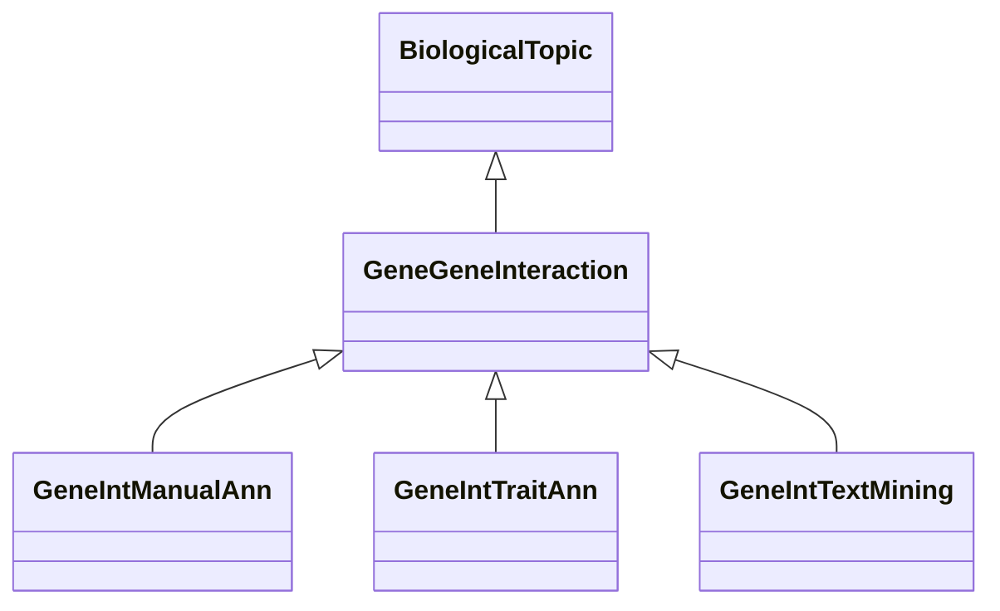

# Class: Gene-Gene Interaction-related Association (GeneGeneInteraction) 


_Associations related to interactions between genes, such as genetic interactions,_

_epistasis, or other forms of gene interactions, direct or indirect._

__


* __NOTE__: this is an abstract class and should not be instantiated directly


URI: [motif:GeneGeneInteraction](https://knetminer.com/terms/motifs/motif-categories/GeneGeneInteraction)





## Inheritance
* [SemanticMotifCategory](SemanticMotifCategory.md)
    * [BiologicalTopic](BiologicalTopic.md)
        * **GeneGeneInteraction**
            * [GeneIntManualAnn](GeneIntManualAnn.md) [ [ManualAnnotation](ManualAnnotation.md)]
            * [GeneIntTraitAnn](GeneIntTraitAnn.md) [ [Gene2TraitAssociation](Gene2TraitAssociation.md)]
            * [GeneIntTextMining](GeneIntTextMining.md) [ [TextMiningAnnotation](TextMiningAnnotation.md)]


## Slots

| Name | Cardinality and Range | Description | Inheritance |
| ---  | --- | --- | --- |


## Identifier and Mapping Information


### Schema Source


* from schema: https://knetminer.com/terms/motifs/motif-categories/schema


## Mappings

| Mapping Type | Mapped Value |
| ---  | ---  |
| self | motif:GeneGeneInteraction |
| native | motif:GeneGeneInteraction |


## LinkML Source

<!-- TODO: investigate https://stackoverflow.com/questions/37606292/how-to-create-tabbed-code-blocks-in-mkdocs-or-sphinx -->

### Direct

<details>
```yaml
name: GeneGeneInteraction
description: 'Associations related to interactions between genes, such as genetic
  interactions,

  epistasis, or other forms of gene interactions, direct or indirect.

  '
title: Gene-Gene Interaction-related Association
from_schema: https://knetminer.com/terms/motifs/motif-categories/schema
is_a: BiologicalTopic
abstract: true

```
</details>

### Induced

<details>
```yaml
name: GeneGeneInteraction
description: 'Associations related to interactions between genes, such as genetic
  interactions,

  epistasis, or other forms of gene interactions, direct or indirect.

  '
title: Gene-Gene Interaction-related Association
from_schema: https://knetminer.com/terms/motifs/motif-categories/schema
is_a: BiologicalTopic
abstract: true

```
</details>