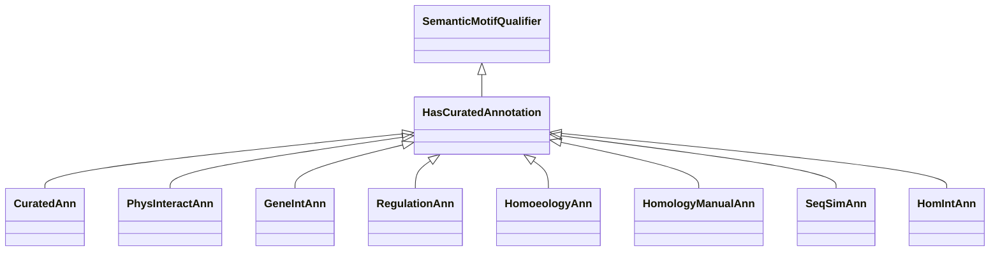

# Class: Human Curated Annotation (HasCuratedAnnotation) 


_A category that has this mix-in represents an annotation provided by a curator or expert,_

_possibly based on some specified method or biological topic (eg, annotation about gene expression)._

__


URI: [motif:HasCuratedAnnotation](https://knetminer.com/terms/motifs/motif-categories/HasCuratedAnnotation)





## Inheritance
* [SemanticMotifQualifier](SemanticMotifQualifier.md)
    * **HasCuratedAnnotation**


## Slots

| Name | Cardinality and Range | Description | Inheritance |
| ---  | --- | --- | --- |


## Mixin Usage

| mixed into | description |
| --- | --- |
| [CuratedAnn](CuratedAnn.md) | Intra-species direct annotation, provided by a curator or expert |
| [PhysInteractAnn](PhysInteractAnn.md) | A curated annotation about physical interaction |
| [GeneIntAnn](GeneIntAnn.md) | An association that represents a manual annotation based on gene-gene interac... |
| [RegulationAnn](RegulationAnn.md) | A curated annotation based on gene expression regulation |
| [HomoeologyAnn](HomoeologyAnn.md) | An association that represents a manual annotation based on homoeology |
| [HomologyManualAnn](HomologyManualAnn.md) | An association that represents a manual annotation based on homology |
| [SeqSimAnn](SeqSimAnn.md) | An association that represents a manual annotation based on sequence similari... |
| [HomIntAnn](HomIntAnn.md) | An association that represents a manual annotation based on homology and inte... |


## Identifier and Mapping Information


### Schema Source


* from schema: https://knetminer.com/terms/motifs/motif-categories/schema


## Mappings

| Mapping Type | Mapped Value |
| ---  | ---  |
| self | motif:HasCuratedAnnotation |
| native | motif:HasCuratedAnnotation |


## LinkML Source

<!-- TODO: investigate https://stackoverflow.com/questions/37606292/how-to-create-tabbed-code-blocks-in-mkdocs-or-sphinx -->

### Direct

<details>
```yaml
name: HasCuratedAnnotation
description: 'A category that has this mix-in represents an annotation provided by
  a curator or expert,

  possibly based on some specified method or biological topic (eg, annotation about
  gene expression).

  '
title: Human Curated Annotation
from_schema: https://knetminer.com/terms/motifs/motif-categories/schema
is_a: SemanticMotifQualifier
mixin: true

```
</details>

### Induced

<details>
```yaml
name: HasCuratedAnnotation
description: 'A category that has this mix-in represents an annotation provided by
  a curator or expert,

  possibly based on some specified method or biological topic (eg, annotation about
  gene expression).

  '
title: Human Curated Annotation
from_schema: https://knetminer.com/terms/motifs/motif-categories/schema
is_a: SemanticMotifQualifier
mixin: true

```
</details>