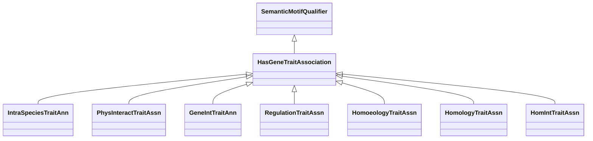

# Class: Text Mining Annotation (HasGeneTraitAssociation) 


_A causal association between a gene or gene variants and a trait it determines or influences._

__

_This is used to subclass some other category to state that the trait association results from _

_the application of some method (eg, text mining, homology)._

__


URI: [motif:HasGeneTraitAssociation](https://knetminer.com/terms/motifs/motif-categories/HasGeneTraitAssociation)





## Inheritance
* [SemanticMotifQualifier](SemanticMotifQualifier.md)
    * **HasGeneTraitAssociation**


## Slots

| Name | Cardinality and Range | Description | Inheritance |
| ---  | --- | --- | --- |


## Mixin Usage

| mixed into | description |
| --- | --- |
| [IntraSpeciesTraitAnn](IntraSpeciesTraitAnn.md) | A gene-trait annotation that is established with information and methods with... |
| [PhysInteractTraitAssn](PhysInteractTraitAssn.md) | A gene-to-trait association based on physical interaction |
| [GeneIntTraitAnn](GeneIntTraitAnn.md) | A gene-to-trait association based on gene-gene interaction |
| [RegulationTraitAssn](RegulationTraitAssn.md) | A gene-to-trait association based on gene expression regulation |
| [HomoeologyTraitAssn](HomoeologyTraitAssn.md) | A gene-to-trait association based on homoeology |
| [HomologyTraitAssn](HomologyTraitAssn.md) | A gene-to-trait association based on homology |
| [HomIntTraitAssn](HomIntTraitAssn.md) | A gene-to-trait association based on homology |


## Identifier and Mapping Information


### Schema Source


* from schema: https://knetminer.com/terms/motifs/motif-categories/schema


## Mappings

| Mapping Type | Mapped Value |
| ---  | ---  |
| self | motif:HasGeneTraitAssociation |
| native | motif:HasGeneTraitAssociation |


## LinkML Source

<!-- TODO: investigate https://stackoverflow.com/questions/37606292/how-to-create-tabbed-code-blocks-in-mkdocs-or-sphinx -->

### Direct

<details>
```yaml
name: HasGeneTraitAssociation
description: "A causal association between a gene or gene variants and a trait it\
  \ determines or influences.\n\nThis is used to subclass some other category to state\
  \ that the trait association results from \nthe application of some method (eg,\
  \ text mining, homology).\n"
title: Text Mining Annotation
from_schema: https://knetminer.com/terms/motifs/motif-categories/schema
is_a: SemanticMotifQualifier
mixin: true

```
</details>

### Induced

<details>
```yaml
name: HasGeneTraitAssociation
description: "A causal association between a gene or gene variants and a trait it\
  \ determines or influences.\n\nThis is used to subclass some other category to state\
  \ that the trait association results from \nthe application of some method (eg,\
  \ text mining, homology).\n"
title: Text Mining Annotation
from_schema: https://knetminer.com/terms/motifs/motif-categories/schema
is_a: SemanticMotifQualifier
mixin: true

```
</details>