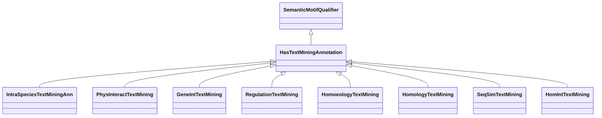

# Class: Text Mining Annotation (HasTextMiningAnnotation) 


_A category that has this mix-in represents an annotation that was computed via text mining methods, _

_such as name-entity recognition, semantic similarity or LLM-based embeddings._

__

_Possibly, the annotation might also be based on a specified method or biological topic _

_(eg, annotation about gene expression)._

__


URI: [motif:HasTextMiningAnnotation](https://knetminer.com/terms/motifs/motif-categories/HasTextMiningAnnotation)





## Inheritance
* [SemanticMotifQualifier](SemanticMotifQualifier.md)
    * **HasTextMiningAnnotation**


## Slots

| Name | Cardinality and Range | Description | Inheritance |
| ---  | --- | --- | --- |


## Mixin Usage

| mixed into | description |
| --- | --- |
| [IntraSpeciesTextMiningAnn](IntraSpeciesTextMiningAnn.md) | An intra-species association that was computed via text mining methods, such ... |
| [PhysInteractTextMining](PhysInteractTextMining.md) | A text mining annotation about on physical interaction |
| [GeneIntTextMining](GeneIntTextMining.md) | An association that represents a text mining annotation based on gene-gene in... |
| [RegulationTextMining](RegulationTextMining.md) | An association that represents a text mining annotation based on gene express... |
| [HomoeologyTextMining](HomoeologyTextMining.md) | An association that represents a text mining annotation based on homoeology |
| [HomologyTextMining](HomologyTextMining.md) | An association that represents a text mining annotation based on homology |
| [SeqSimTextMining](SeqSimTextMining.md) | An association that represents a text mining annotation based on sequence sim... |
| [HomIntTextMining](HomIntTextMining.md) | An association that represents a text mining annotation based on homology and... |


## Identifier and Mapping Information


### Schema Source


* from schema: https://knetminer.com/terms/motifs/motif-categories/schema


## Mappings

| Mapping Type | Mapped Value |
| ---  | ---  |
| self | motif:HasTextMiningAnnotation |
| native | motif:HasTextMiningAnnotation |


## LinkML Source

<!-- TODO: investigate https://stackoverflow.com/questions/37606292/how-to-create-tabbed-code-blocks-in-mkdocs-or-sphinx -->

### Direct

<details>
```yaml
name: HasTextMiningAnnotation
description: "A category that has this mix-in represents an annotation that was computed\
  \ via text mining methods, \nsuch as name-entity recognition, semantic similarity\
  \ or LLM-based embeddings.\n\nPossibly, the annotation might also be based on a\
  \ specified method or biological topic \n(eg, annotation about gene expression).\n"
title: Text Mining Annotation
from_schema: https://knetminer.com/terms/motifs/motif-categories/schema
is_a: SemanticMotifQualifier
mixin: true

```
</details>

### Induced

<details>
```yaml
name: HasTextMiningAnnotation
description: "A category that has this mix-in represents an annotation that was computed\
  \ via text mining methods, \nsuch as name-entity recognition, semantic similarity\
  \ or LLM-based embeddings.\n\nPossibly, the annotation might also be based on a\
  \ specified method or biological topic \n(eg, annotation about gene expression).\n"
title: Text Mining Annotation
from_schema: https://knetminer.com/terms/motifs/motif-categories/schema
is_a: SemanticMotifQualifier
mixin: true

```
</details>