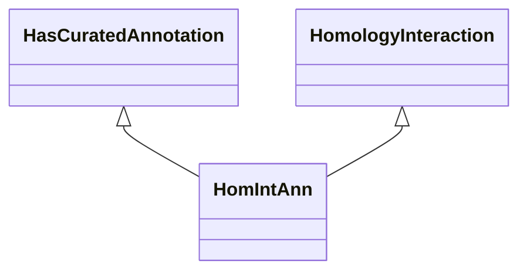

# Class: Homology Interaction Annotation (HomIntAnn) 


_An association that represents a manual annotation based on homology and interaction._

__


URI: [motif:HomIntAnn](https://knetminer.com/terms/motifs/motif-categories/HomIntAnn)





## Inheritance
* [SemanticMotifCategory](SemanticMotifCategory.md)
    * [HomologyInteraction](HomologyInteraction.md)
        * **HomIntAnn** [ [HasCuratedAnnotation](HasCuratedAnnotation.md)]


## Slots

| Name | Cardinality and Range | Description | Inheritance |
| ---  | --- | --- | --- |


## Identifier and Mapping Information


### Annotations

| property | value |
| --- | --- |
| originalCategory | homint::annotation |


### Schema Source


* from schema: https://knetminer.com/terms/motifs/motif-categories/schema


## Mappings

| Mapping Type | Mapped Value |
| ---  | ---  |
| self | motif:HomIntAnn |
| native | motif:HomIntAnn |


## LinkML Source

<!-- TODO: investigate https://stackoverflow.com/questions/37606292/how-to-create-tabbed-code-blocks-in-mkdocs-or-sphinx -->

### Direct

<details>
```yaml
name: HomIntAnn
annotations:
  originalCategory:
    tag: originalCategory
    value: homint::annotation
description: 'An association that represents a manual annotation based on homology
  and interaction.

  '
title: Homology Interaction Annotation
notes:
- 'original category no: 5.1'
from_schema: https://knetminer.com/terms/motifs/motif-categories/schema
is_a: HomologyInteraction
mixins:
- HasCuratedAnnotation

```
</details>

### Induced

<details>
```yaml
name: HomIntAnn
annotations:
  originalCategory:
    tag: originalCategory
    value: homint::annotation
description: 'An association that represents a manual annotation based on homology
  and interaction.

  '
title: Homology Interaction Annotation
notes:
- 'original category no: 5.1'
from_schema: https://knetminer.com/terms/motifs/motif-categories/schema
is_a: HomologyInteraction
mixins:
- HasCuratedAnnotation

```
</details>