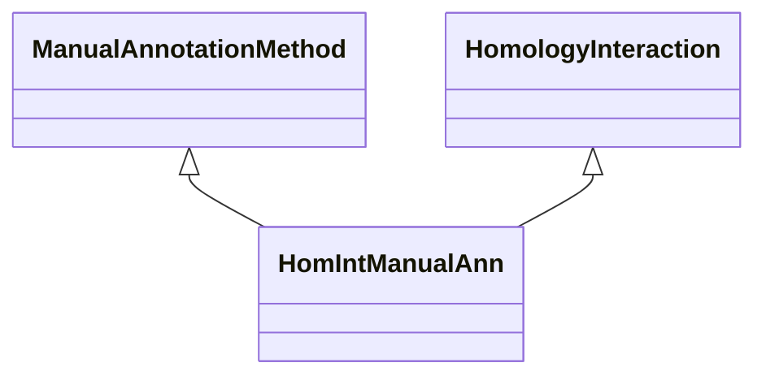

# Class: Manual Annotation via homology and interaction (HomIntManualAnn) 


_An association that represents a manual annotation based on homology and interaction._

__


URI: [motif:HomIntManualAnn](https://knetminer.com/terms/motifs/motif-categories/HomIntManualAnn)





## Inheritance
* [SemanticMotifCategory](SemanticMotifCategory.md)
    * [BiologicalTopic](BiologicalTopic.md)
        * [Phylogeny](Phylogeny.md)
            * [Homology](Homology.md) [ [CrossSpeciesAssociation](CrossSpeciesAssociation.md)]
                * [HomologyInteraction](HomologyInteraction.md)
                    * **HomIntManualAnn** [ [ManualAnnotationMethod](ManualAnnotationMethod.md)]


## Slots

| Name | Cardinality and Range | Description | Inheritance |
| ---  | --- | --- | --- |


## Identifier and Mapping Information


### Annotations

| property | value |
| --- | --- |
| originalCategory | homint::annotation |


### Schema Source


* from schema: https://knetminer.com/terms/motifs/motif-categories/schema


## Mappings

| Mapping Type | Mapped Value |
| ---  | ---  |
| self | motif:HomIntManualAnn |
| native | motif:HomIntManualAnn |


## LinkML Source

<!-- TODO: investigate https://stackoverflow.com/questions/37606292/how-to-create-tabbed-code-blocks-in-mkdocs-or-sphinx -->

### Direct

<details>
```yaml
name: HomIntManualAnn
annotations:
  originalCategory:
    tag: originalCategory
    value: homint::annotation
description: 'An association that represents a manual annotation based on homology
  and interaction.

  '
title: Manual Annotation via homology and interaction
notes:
- 'original category no: 5.1'
from_schema: https://knetminer.com/terms/motifs/motif-categories/schema
is_a: HomologyInteraction
mixins:
- ManualAnnotationMethod

```
</details>

### Induced

<details>
```yaml
name: HomIntManualAnn
annotations:
  originalCategory:
    tag: originalCategory
    value: homint::annotation
description: 'An association that represents a manual annotation based on homology
  and interaction.

  '
title: Manual Annotation via homology and interaction
notes:
- 'original category no: 5.1'
from_schema: https://knetminer.com/terms/motifs/motif-categories/schema
is_a: HomologyInteraction
mixins:
- ManualAnnotationMethod

```
</details>