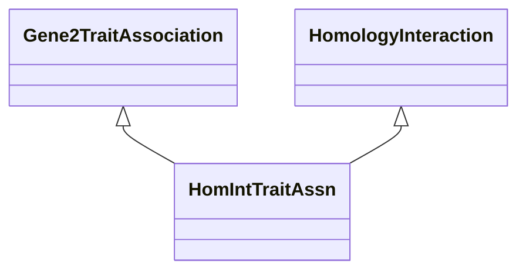

# Class: Gene-to-Trait Association via homology and interaction (HomIntTraitAssn) 


_A gene-to-trait association based on homology._

__


URI: [motif:HomIntTraitAssn](https://knetminer.com/terms/motifs/motif-categories/HomIntTraitAssn)





## Inheritance
* [SemanticMotifCategory](SemanticMotifCategory.md)
    * [BiologicalTopic](BiologicalTopic.md)
        * [Phylogeny](Phylogeny.md)
            * [Homology](Homology.md) [ [CrossSpeciesAssociation](CrossSpeciesAssociation.md)]
                * [HomologyInteraction](HomologyInteraction.md)
                    * **HomIntTraitAssn** [ [Gene2TraitAssociation](Gene2TraitAssociation.md)]


## Slots

| Name | Cardinality and Range | Description | Inheritance |
| ---  | --- | --- | --- |


## Identifier and Mapping Information


### Annotations

| property | value |
| --- | --- |
| originalCategory | homint::genetics |


### Schema Source


* from schema: https://knetminer.com/terms/motifs/motif-categories/schema


## Mappings

| Mapping Type | Mapped Value |
| ---  | ---  |
| self | motif:HomIntTraitAssn |
| native | motif:HomIntTraitAssn |


## LinkML Source

<!-- TODO: investigate https://stackoverflow.com/questions/37606292/how-to-create-tabbed-code-blocks-in-mkdocs-or-sphinx -->

### Direct

<details>
```yaml
name: HomIntTraitAssn
annotations:
  originalCategory:
    tag: originalCategory
    value: homint::genetics
description: 'A gene-to-trait association based on homology.

  '
title: Gene-to-Trait Association via homology and interaction
notes:
- 'original category no: 5.2'
from_schema: https://knetminer.com/terms/motifs/motif-categories/schema
is_a: HomologyInteraction
mixins:
- Gene2TraitAssociation

```
</details>

### Induced

<details>
```yaml
name: HomIntTraitAssn
annotations:
  originalCategory:
    tag: originalCategory
    value: homint::genetics
description: 'A gene-to-trait association based on homology.

  '
title: Gene-to-Trait Association via homology and interaction
notes:
- 'original category no: 5.2'
from_schema: https://knetminer.com/terms/motifs/motif-categories/schema
is_a: HomologyInteraction
mixins:
- Gene2TraitAssociation

```
</details>