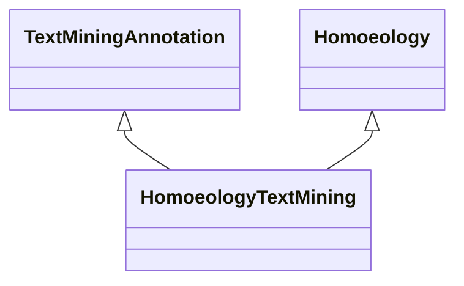

# Class: Text Mining Annotation about Homoeology (HomoeologyTextMining) 


_An association that represents a text mining annotation based on homoeology._

__


URI: [motif:HomoeologyTextMining](https://knetminer.com/terms/motifs/motif-categories/HomoeologyTextMining)





## Inheritance
* [SemanticMotifCategory](SemanticMotifCategory.md)
    * [BiologicalTopic](BiologicalTopic.md)
        * [Phylogeny](Phylogeny.md)
            * [Homoeology](Homoeology.md) [ [IntraSpecieAssociation](IntraSpecieAssociation.md)]
                * **HomoeologyTextMining** [ [TextMiningAnnotation](TextMiningAnnotation.md)]


## Slots

| Name | Cardinality and Range | Description | Inheritance |
| ---  | --- | --- | --- |


## Identifier and Mapping Information


### Annotations

| property | value |
| --- | --- |
| associationStrength | 3.2 |


### Schema Source


* from schema: https://knetminer.com/terms/motifs/motif-categories/schema


## Mappings

| Mapping Type | Mapped Value |
| ---  | ---  |
| self | motif:HomoeologyTextMining |
| native | motif:HomoeologyTextMining |


## LinkML Source

<!-- TODO: investigate https://stackoverflow.com/questions/37606292/how-to-create-tabbed-code-blocks-in-mkdocs-or-sphinx -->

### Direct

<details>
```yaml
name: HomoeologyTextMining
annotations:
  associationStrength:
    tag: associationStrength
    value: 3.2
description: 'An association that represents a text mining annotation based on homoeology.

  '
title: Text Mining Annotation about Homoeology
notes:
- 'original category: 3.6'
from_schema: https://knetminer.com/terms/motifs/motif-categories/schema
is_a: Homoeology
mixins:
- TextMiningAnnotation

```
</details>

### Induced

<details>
```yaml
name: HomoeologyTextMining
annotations:
  associationStrength:
    tag: associationStrength
    value: 3.2
description: 'An association that represents a text mining annotation based on homoeology.

  '
title: Text Mining Annotation about Homoeology
notes:
- 'original category: 3.6'
from_schema: https://knetminer.com/terms/motifs/motif-categories/schema
is_a: Homoeology
mixins:
- TextMiningAnnotation

```
</details>