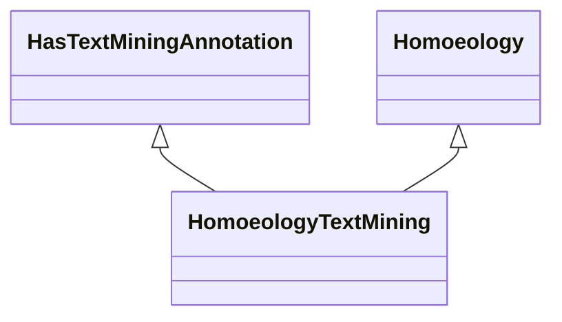

# Class: Homoeology Text Mining (HomoeologyTextMining) 


_An association that represents a text mining annotation based on homoeology._

__


URI: [motif:HomoeologyTextMining](https://knetminer.com/terms/motifs/motif-categories/HomoeologyTextMining)





## Inheritance
* [SemanticMotifCategory](SemanticMotifCategory.md)
    * [PhylogenyConfidentAssociation](PhylogenyConfidentAssociation.md)
        * [Homoeology](Homoeology.md) [ [IntraSpeciesAssociation](IntraSpeciesAssociation.md)]
            * **HomoeologyTextMining** [ [HasTextMiningAnnotation](HasTextMiningAnnotation.md)]


## Slots

| Name | Cardinality and Range | Description | Inheritance |
| ---  | --- | --- | --- |


## Identifier and Mapping Information


### Annotations

| property | value |
| --- | --- |
| originalCategories | phylogeny::homoeology::literature |


### Schema Source


* from schema: https://knetminer.com/terms/motifs/motif-categories/schema


## Mappings

| Mapping Type | Mapped Value |
| ---  | ---  |
| self | motif:HomoeologyTextMining |
| native | motif:HomoeologyTextMining |


## LinkML Source

<!-- TODO: investigate https://stackoverflow.com/questions/37606292/how-to-create-tabbed-code-blocks-in-mkdocs-or-sphinx -->

### Direct

<details>
```yaml
name: HomoeologyTextMining
annotations:
  originalCategories:
    tag: originalCategories
    value: phylogeny::homoeology::literature
description: 'An association that represents a text mining annotation based on homoeology.

  '
title: Homoeology Text Mining
notes:
- 'original category no: 3.6'
from_schema: https://knetminer.com/terms/motifs/motif-categories/schema
is_a: Homoeology
mixins:
- HasTextMiningAnnotation

```
</details>

### Induced

<details>
```yaml
name: HomoeologyTextMining
annotations:
  originalCategories:
    tag: originalCategories
    value: phylogeny::homoeology::literature
description: 'An association that represents a text mining annotation based on homoeology.

  '
title: Homoeology Text Mining
notes:
- 'original category no: 3.6'
from_schema: https://knetminer.com/terms/motifs/motif-categories/schema
is_a: Homoeology
mixins:
- HasTextMiningAnnotation

```
</details>