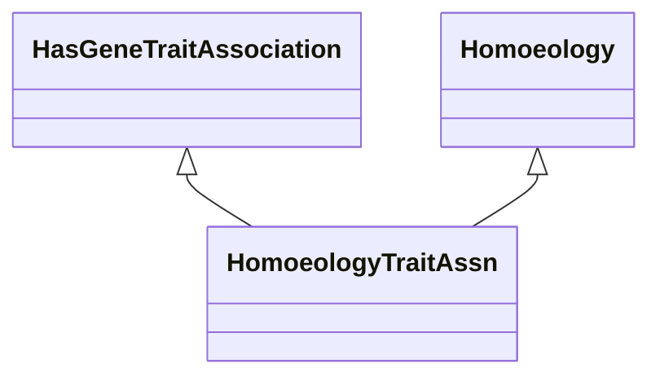

# Class: Homoeology Trait (HomoeologyTraitAssn) 


_A gene-to-trait association based on homoeology._

__


URI: [motif:HomoeologyTraitAssn](https://knetminer.com/terms/motifs/motif-categories/HomoeologyTraitAssn)





## Inheritance
* [SemanticMotifCategory](SemanticMotifCategory.md)
    * [PhylogenyConfidentAssociation](PhylogenyConfidentAssociation.md)
        * [Homoeology](Homoeology.md) [ [IntraSpeciesAssociation](IntraSpeciesAssociation.md)]
            * **HomoeologyTraitAssn** [ [HasGeneTraitAssociation](HasGeneTraitAssociation.md)]


## Slots

| Name | Cardinality and Range | Description | Inheritance |
| ---  | --- | --- | --- |


## Identifier and Mapping Information


### Annotations

| property | value |
| --- | --- |
| originalCategory | phylogeny::homoeology::genetics |


### Schema Source


* from schema: https://knetminer.com/terms/motifs/motif-categories/schema


## Mappings

| Mapping Type | Mapped Value |
| ---  | ---  |
| self | motif:HomoeologyTraitAssn |
| native | motif:HomoeologyTraitAssn |


## LinkML Source

<!-- TODO: investigate https://stackoverflow.com/questions/37606292/how-to-create-tabbed-code-blocks-in-mkdocs-or-sphinx -->

### Direct

<details>
```yaml
name: HomoeologyTraitAssn
annotations:
  originalCategory:
    tag: originalCategory
    value: phylogeny::homoeology::genetics
description: 'A gene-to-trait association based on homoeology.

  '
title: Homoeology Trait
notes:
- 'original category no: 3.5'
from_schema: https://knetminer.com/terms/motifs/motif-categories/schema
is_a: Homoeology
mixins:
- HasGeneTraitAssociation

```
</details>

### Induced

<details>
```yaml
name: HomoeologyTraitAssn
annotations:
  originalCategory:
    tag: originalCategory
    value: phylogeny::homoeology::genetics
description: 'A gene-to-trait association based on homoeology.

  '
title: Homoeology Trait
notes:
- 'original category no: 3.5'
from_schema: https://knetminer.com/terms/motifs/motif-categories/schema
is_a: Homoeology
mixins:
- HasGeneTraitAssociation

```
</details>