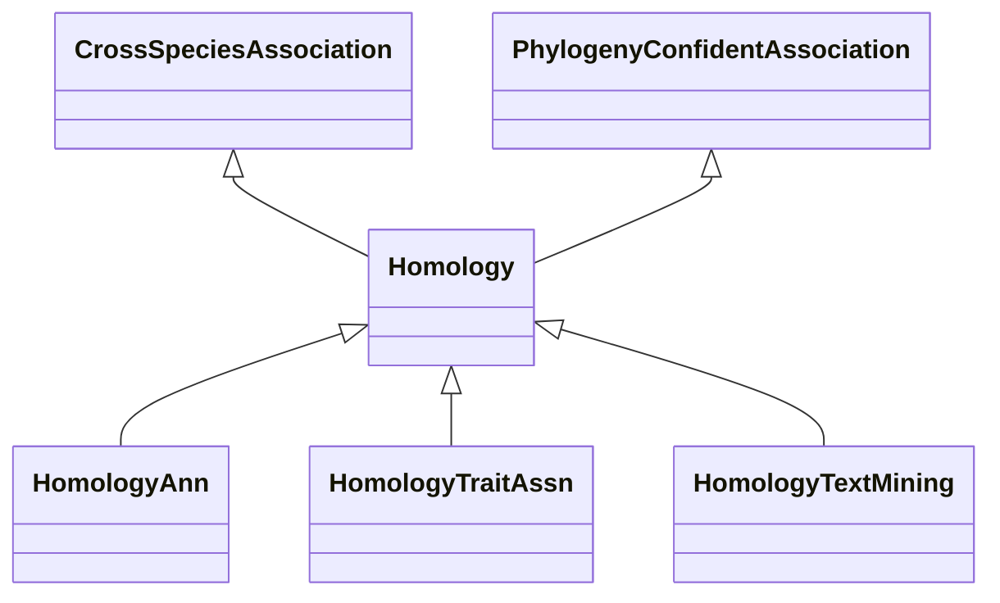

# Class: Homology (Homology) 


_Associations related to homology, that it, cross-species gene similarity resulting from _

_shared ancestry._

_Based on the meaning of this term, this class is made a subclass of 'CrossSpeciesAssociation'._

__


* __NOTE__: this is an abstract class and should not be instantiated directly


URI: [motif:Homology](https://knetminer.com/terms/motifs/motif-categories/Homology)





## Inheritance
* [SemanticMotifCategory](SemanticMotifCategory.md)
    * [PhylogenyConfidentAssociation](PhylogenyConfidentAssociation.md)
        * **Homology** [ [CrossSpeciesAssociation](CrossSpeciesAssociation.md)]
            * [HomologyAnn](HomologyAnn.md) [ [HasCuratedAnnotation](HasCuratedAnnotation.md)]
            * [HomologyTraitAssn](HomologyTraitAssn.md) [ [HasGeneTraitAssociation](HasGeneTraitAssociation.md)]
            * [HomologyTextMining](HomologyTextMining.md) [ [HasTextMiningAnnotation](HasTextMiningAnnotation.md)]


## Slots

| Name | Cardinality and Range | Description | Inheritance |
| ---  | --- | --- | --- |


## Identifier and Mapping Information


### Schema Source


* from schema: https://knetminer.com/terms/motifs/motif-categories/schema


## Mappings

| Mapping Type | Mapped Value |
| ---  | ---  |
| self | motif:Homology |
| native | motif:Homology |


## LinkML Source

<!-- TODO: investigate https://stackoverflow.com/questions/37606292/how-to-create-tabbed-code-blocks-in-mkdocs-or-sphinx -->

### Direct

<details>
```yaml
name: Homology
description: "Associations related to homology, that it, cross-species gene similarity\
  \ resulting from \nshared ancestry.\nBased on the meaning of this term, this class\
  \ is made a subclass of 'CrossSpeciesAssociation'.\n"
title: Homology
from_schema: https://knetminer.com/terms/motifs/motif-categories/schema
is_a: PhylogenyConfidentAssociation
abstract: true
mixins:
- CrossSpeciesAssociation

```
</details>

### Induced

<details>
```yaml
name: Homology
description: "Associations related to homology, that it, cross-species gene similarity\
  \ resulting from \nshared ancestry.\nBased on the meaning of this term, this class\
  \ is made a subclass of 'CrossSpeciesAssociation'.\n"
title: Homology
from_schema: https://knetminer.com/terms/motifs/motif-categories/schema
is_a: PhylogenyConfidentAssociation
abstract: true
mixins:
- CrossSpeciesAssociation

```
</details>