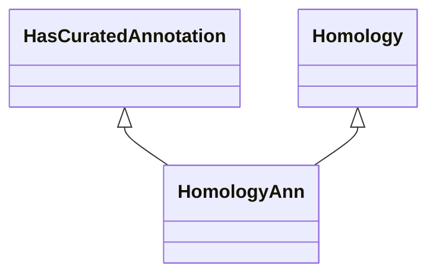

# Class: Homology Annotation (HomologyAnn) 


_An association that represents a manual annotation based on homology._

__


URI: [motif:HomologyAnn](https://knetminer.com/terms/motifs/motif-categories/HomologyAnn)





## Inheritance
* [SemanticMotifCategory](SemanticMotifCategory.md)
    * [PhylogenyConfidentAssociation](PhylogenyConfidentAssociation.md)
        * [Homology](Homology.md) [ [CrossSpeciesAssociation](CrossSpeciesAssociation.md)]
            * **HomologyAnn** [ [HasCuratedAnnotation](HasCuratedAnnotation.md)]


## Slots

| Name | Cardinality and Range | Description | Inheritance |
| ---  | --- | --- | --- |


## Identifier and Mapping Information


### Annotations

| property | value |
| --- | --- |
| originalCategories | phylogeny::homology::annotation, HomologyManualAnn |


### Schema Source


* from schema: https://knetminer.com/terms/motifs/motif-categories/schema


## Mappings

| Mapping Type | Mapped Value |
| ---  | ---  |
| self | motif:HomologyAnn |
| native | motif:HomologyAnn |


## LinkML Source

<!-- TODO: investigate https://stackoverflow.com/questions/37606292/how-to-create-tabbed-code-blocks-in-mkdocs-or-sphinx -->

### Direct

<details>
```yaml
name: HomologyAnn
annotations:
  originalCategories:
    tag: originalCategories
    value: phylogeny::homology::annotation, HomologyManualAnn
description: 'An association that represents a manual annotation based on homology.

  '
title: Homology Annotation
notes:
- 'original category no: 3.1'
from_schema: https://knetminer.com/terms/motifs/motif-categories/schema
is_a: Homology
mixins:
- HasCuratedAnnotation

```
</details>

### Induced

<details>
```yaml
name: HomologyAnn
annotations:
  originalCategories:
    tag: originalCategories
    value: phylogeny::homology::annotation, HomologyManualAnn
description: 'An association that represents a manual annotation based on homology.

  '
title: Homology Annotation
notes:
- 'original category no: 3.1'
from_schema: https://knetminer.com/terms/motifs/motif-categories/schema
is_a: Homology
mixins:
- HasCuratedAnnotation

```
</details>