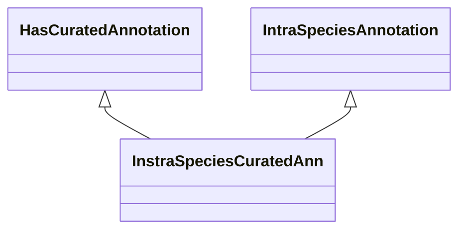

# Class: Direct Annotation (InstraSpeciesCuratedAnn) 


_Intra-species direct annotation, provided by a curator or expert._

__


URI: [motif:InstraSpeciesCuratedAnn](https://knetminer.com/terms/motifs/motif-categories/InstraSpeciesCuratedAnn)





## Inheritance
* [SemanticMotifCategory](SemanticMotifCategory.md)
    * [IntraSpeciesAnnotation](IntraSpeciesAnnotation.md) [ [IntraSpeciesAssociation](IntraSpeciesAssociation.md)]
        * **InstraSpeciesCuratedAnn** [ [HasCuratedAnnotation](HasCuratedAnnotation.md)]


## Slots

| Name | Cardinality and Range | Description | Inheritance |
| ---  | --- | --- | --- |


## Identifier and Mapping Information


### Annotations

| property | value |
| --- | --- |
| originalCategories | direct::annotation, ManualAnnotation |


### Schema Source


* from schema: https://knetminer.com/terms/motifs/motif-categories/schema


## Mappings

| Mapping Type | Mapped Value |
| ---  | ---  |
| self | motif:InstraSpeciesCuratedAnn |
| native | motif:InstraSpeciesCuratedAnn |


## LinkML Source

<!-- TODO: investigate https://stackoverflow.com/questions/37606292/how-to-create-tabbed-code-blocks-in-mkdocs-or-sphinx -->

### Direct

<details>
```yaml
name: InstraSpeciesCuratedAnn
annotations:
  originalCategories:
    tag: originalCategories
    value: direct::annotation, ManualAnnotation
description: 'Intra-species direct annotation, provided by a curator or expert.

  '
title: Direct Annotation
notes:
- 'original category no: 1.1'
from_schema: https://knetminer.com/terms/motifs/motif-categories/schema
is_a: IntraSpeciesAnnotation
mixins:
- HasCuratedAnnotation

```
</details>

### Induced

<details>
```yaml
name: InstraSpeciesCuratedAnn
annotations:
  originalCategories:
    tag: originalCategories
    value: direct::annotation, ManualAnnotation
description: 'Intra-species direct annotation, provided by a curator or expert.

  '
title: Direct Annotation
notes:
- 'original category no: 1.1'
from_schema: https://knetminer.com/terms/motifs/motif-categories/schema
is_a: IntraSpeciesAnnotation
mixins:
- HasCuratedAnnotation

```
</details>