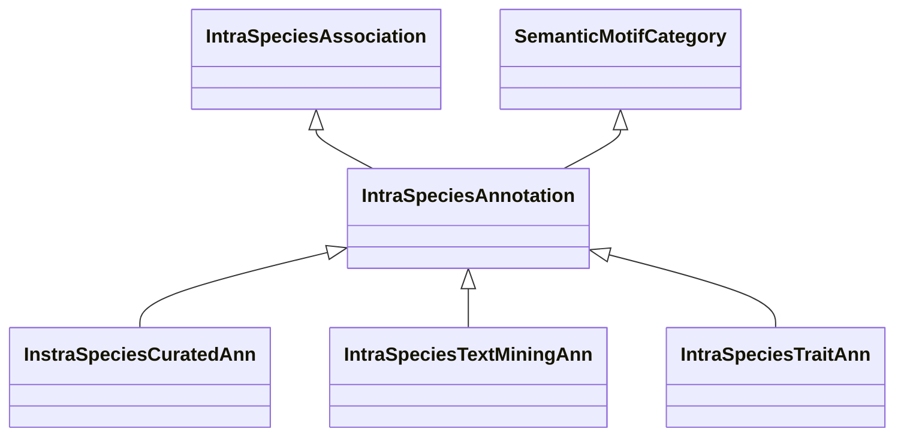

# Class: Intra-Species Annotation (IntraSpeciesAnnotation) 


_Annotations between genes and other entities that are within the same species. These _

_includes manually curated annotations and text mining annotations._

__


* __NOTE__: this is an abstract class and should not be instantiated directly


URI: [motif:IntraSpeciesAnnotation](https://knetminer.com/terms/motifs/motif-categories/IntraSpeciesAnnotation)





## Inheritance
* [SemanticMotifCategory](SemanticMotifCategory.md)
    * **IntraSpeciesAnnotation** [ [IntraSpeciesAssociation](IntraSpeciesAssociation.md)]
        * [InstraSpeciesCuratedAnn](InstraSpeciesCuratedAnn.md) [ [HasCuratedAnnotation](HasCuratedAnnotation.md)]
        * [IntraSpeciesTextMiningAnn](IntraSpeciesTextMiningAnn.md) [ [HasTextMiningAnnotation](HasTextMiningAnnotation.md)]
        * [IntraSpeciesTraitAnn](IntraSpeciesTraitAnn.md) [ [HasGeneTraitAssociation](HasGeneTraitAssociation.md)]


## Slots

| Name | Cardinality and Range | Description | Inheritance |
| ---  | --- | --- | --- |


## Identifier and Mapping Information


### Schema Source


* from schema: https://knetminer.com/terms/motifs/motif-categories/schema


## Mappings

| Mapping Type | Mapped Value |
| ---  | ---  |
| self | motif:IntraSpeciesAnnotation |
| native | motif:IntraSpeciesAnnotation |


## LinkML Source

<!-- TODO: investigate https://stackoverflow.com/questions/37606292/how-to-create-tabbed-code-blocks-in-mkdocs-or-sphinx -->

### Direct

<details>
```yaml
name: IntraSpeciesAnnotation
description: "Annotations between genes and other entities that are within the same\
  \ species. These \nincludes manually curated annotations and text mining annotations.\n"
title: Intra-Species Annotation
from_schema: https://knetminer.com/terms/motifs/motif-categories/schema
is_a: SemanticMotifCategory
abstract: true
mixins:
- IntraSpeciesAssociation

```
</details>

### Induced

<details>
```yaml
name: IntraSpeciesAnnotation
description: "Annotations between genes and other entities that are within the same\
  \ species. These \nincludes manually curated annotations and text mining annotations.\n"
title: Intra-Species Annotation
from_schema: https://knetminer.com/terms/motifs/motif-categories/schema
is_a: SemanticMotifCategory
abstract: true
mixins:
- IntraSpeciesAssociation

```
</details>