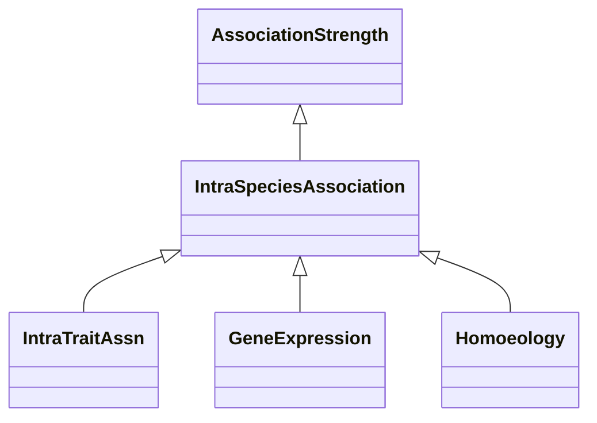

# Class: Intra-Species Association (IntraSpeciesAssociation) 


_Associations in this category are based on the same species of the gene that is considered, contrary_

_to, eg, homology or sequence similarity._

__


* __NOTE__: this is an abstract class and should not be instantiated directly


URI: [motif:IntraSpeciesAssociation](https://knetminer.com/terms/motifs/motif-categories/IntraSpeciesAssociation)





## Inheritance
* [SemanticMotifCategory](SemanticMotifCategory.md)
    * [AssociationStrength](AssociationStrength.md)
        * **IntraSpeciesAssociation**


## Slots

| Name | Cardinality and Range | Description | Inheritance |
| ---  | --- | --- | --- |


## Mixin Usage

| mixed into | description |
| --- | --- |
| [IntraTraitAssn](IntraTraitAssn.md) | A gene-trait association that is established with information and methods wit... |
| [GeneExpression](GeneExpression.md) | Associations of this type are related to gene expression, for instance becaus... |
| [Homoeology](Homoeology.md) | Associations related to homoeology |


## Identifier and Mapping Information


### Annotations

| property | value |
| --- | --- |
| associationStrength | 1 |


### Schema Source


* from schema: https://knetminer.com/terms/motifs/motif-categories/schema


## Mappings

| Mapping Type | Mapped Value |
| ---  | ---  |
| self | motif:IntraSpeciesAssociation |
| native | motif:IntraSpeciesAssociation |


## LinkML Source

<!-- TODO: investigate https://stackoverflow.com/questions/37606292/how-to-create-tabbed-code-blocks-in-mkdocs-or-sphinx -->

### Direct

<details>
```yaml
name: IntraSpeciesAssociation
annotations:
  associationStrength:
    tag: associationStrength
    value: 1
description: 'Associations in this category are based on the same species of the gene
  that is considered, contrary

  to, eg, homology or sequence similarity.

  '
title: Intra-Species Association
from_schema: https://knetminer.com/terms/motifs/motif-categories/schema
is_a: AssociationStrength
abstract: true
mixin: true

```
</details>

### Induced

<details>
```yaml
name: IntraSpeciesAssociation
annotations:
  associationStrength:
    tag: associationStrength
    value: 1
description: 'Associations in this category are based on the same species of the gene
  that is considered, contrary

  to, eg, homology or sequence similarity.

  '
title: Intra-Species Association
from_schema: https://knetminer.com/terms/motifs/motif-categories/schema
is_a: AssociationStrength
abstract: true
mixin: true

```
</details>