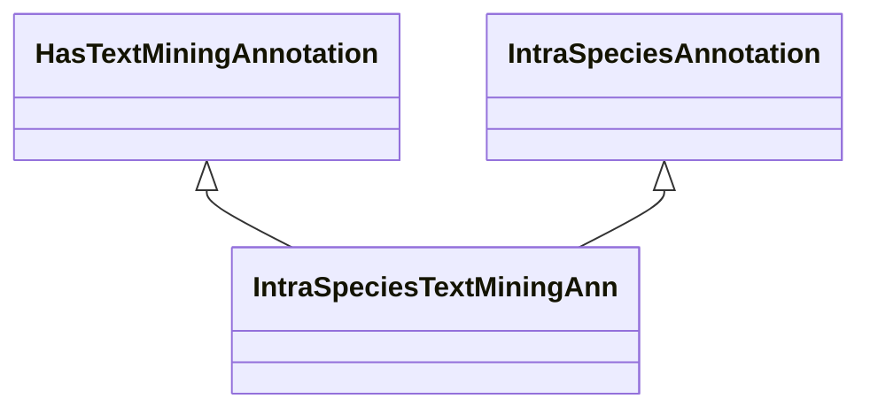

# Class: Text Mining Annotation (IntraSpeciesTextMiningAnn) 


_An intra-species association that was computed via text mining methods, such as name-entity _

_recognition, semantic similarity or LLM-based embeddings._

__


URI: [motif:IntraSpeciesTextMiningAnn](https://knetminer.com/terms/motifs/motif-categories/IntraSpeciesTextMiningAnn)





## Inheritance
* [SemanticMotifCategory](SemanticMotifCategory.md)
    * [IntraSpeciesAnnotation](IntraSpeciesAnnotation.md) [ [IntraSpeciesAssociation](IntraSpeciesAssociation.md)]
        * **IntraSpeciesTextMiningAnn** [ [HasTextMiningAnnotation](HasTextMiningAnnotation.md)]


## Slots

| Name | Cardinality and Range | Description | Inheritance |
| ---  | --- | --- | --- |


## Identifier and Mapping Information


### Annotations

| property | value |
| --- | --- |
| originalCategory | direct::literature |


### Schema Source


* from schema: https://knetminer.com/terms/motifs/motif-categories/schema


## Mappings

| Mapping Type | Mapped Value |
| ---  | ---  |
| self | motif:IntraSpeciesTextMiningAnn |
| native | motif:IntraSpeciesTextMiningAnn |


## LinkML Source

<!-- TODO: investigate https://stackoverflow.com/questions/37606292/how-to-create-tabbed-code-blocks-in-mkdocs-or-sphinx -->

### Direct

<details>
```yaml
name: IntraSpeciesTextMiningAnn
annotations:
  originalCategory:
    tag: originalCategory
    value: direct::literature
description: "An intra-species association that was computed via text mining methods,\
  \ such as name-entity \nrecognition, semantic similarity or LLM-based embeddings.\n"
title: Text Mining Annotation
notes:
- 'original category no: 1.3'
from_schema: https://knetminer.com/terms/motifs/motif-categories/schema
is_a: IntraSpeciesAnnotation
mixins:
- HasTextMiningAnnotation

```
</details>

### Induced

<details>
```yaml
name: IntraSpeciesTextMiningAnn
annotations:
  originalCategory:
    tag: originalCategory
    value: direct::literature
description: "An intra-species association that was computed via text mining methods,\
  \ such as name-entity \nrecognition, semantic similarity or LLM-based embeddings.\n"
title: Text Mining Annotation
notes:
- 'original category no: 1.3'
from_schema: https://knetminer.com/terms/motifs/motif-categories/schema
is_a: IntraSpeciesAnnotation
mixins:
- HasTextMiningAnnotation

```
</details>