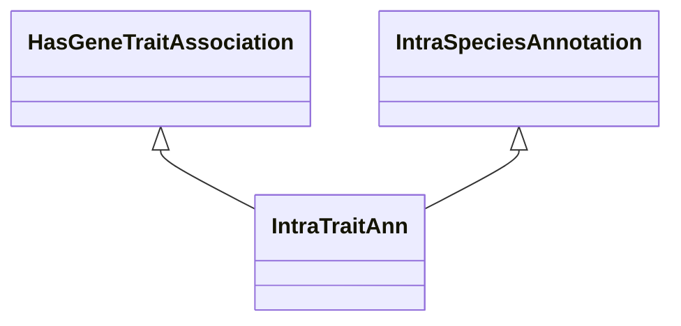

# Class: Gene-Trait Annotation (IntraTraitAnn) 


_A gene-trait annotation that is established with information and methods within the same species_

_as the annotation target gene (eg through GWAS experiments)._

__


URI: [motif:IntraTraitAnn](https://knetminer.com/terms/motifs/motif-categories/IntraTraitAnn)





## Inheritance
* [SemanticMotifCategory](SemanticMotifCategory.md)
    * [IntraSpeciesAnnotation](IntraSpeciesAnnotation.md) [ [IntraSpeciesAssociation](IntraSpeciesAssociation.md)]
        * **IntraTraitAnn** [ [HasGeneTraitAssociation](HasGeneTraitAssociation.md)]


## Slots

| Name | Cardinality and Range | Description | Inheritance |
| ---  | --- | --- | --- |


## Identifier and Mapping Information


### Annotations

| property | value |
| --- | --- |
| originalCategory | direct::genetics |


### Schema Source


* from schema: https://knetminer.com/terms/motifs/motif-categories/schema


## Mappings

| Mapping Type | Mapped Value |
| ---  | ---  |
| self | motif:IntraTraitAnn |
| native | motif:IntraTraitAnn |


## LinkML Source

<!-- TODO: investigate https://stackoverflow.com/questions/37606292/how-to-create-tabbed-code-blocks-in-mkdocs-or-sphinx -->

### Direct

<details>
```yaml
name: IntraTraitAnn
annotations:
  originalCategory:
    tag: originalCategory
    value: direct::genetics
description: 'A gene-trait annotation that is established with information and methods
  within the same species

  as the annotation target gene (eg through GWAS experiments).

  '
title: Gene-Trait Annotation
notes:
- 'original category no: 1.2'
from_schema: https://knetminer.com/terms/motifs/motif-categories/schema
is_a: IntraSpeciesAnnotation
mixins:
- HasGeneTraitAssociation

```
</details>

### Induced

<details>
```yaml
name: IntraTraitAnn
annotations:
  originalCategory:
    tag: originalCategory
    value: direct::genetics
description: 'A gene-trait annotation that is established with information and methods
  within the same species

  as the annotation target gene (eg through GWAS experiments).

  '
title: Gene-Trait Annotation
notes:
- 'original category no: 1.2'
from_schema: https://knetminer.com/terms/motifs/motif-categories/schema
is_a: IntraSpeciesAnnotation
mixins:
- HasGeneTraitAssociation

```
</details>