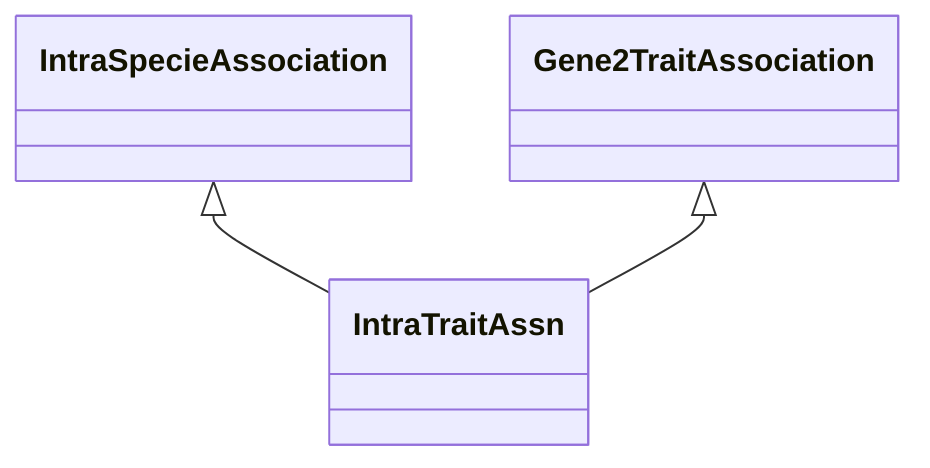

# Class: Intra-specie Gene-Trait Association (IntraTraitAssn) 


_A gene-trait association that is established with information and methods within the same specie_

_as the association target gene._

__


URI: [motif:IntraTraitAssn](https://knetminer.com/terms/motifs/motif-categories/IntraTraitAssn)





## Inheritance
* [SemanticMotifCategory](SemanticMotifCategory.md)
    * [BiologicalTopic](BiologicalTopic.md)
        * [Gene2PhenotypeAssociation](Gene2PhenotypeAssociation.md)
            * [Gene2TraitAssociation](Gene2TraitAssociation.md)
                * **IntraTraitAssn** [ [IntraSpecieAssociation](IntraSpecieAssociation.md)]


## Slots

| Name | Cardinality and Range | Description | Inheritance |
| ---  | --- | --- | --- |


## Identifier and Mapping Information


### Annotations

| property | value |
| --- | --- |
| originalCategory | direct::genetics |


### Schema Source


* from schema: https://knetminer.com/terms/motifs/motif-categories/schema


## Mappings

| Mapping Type | Mapped Value |
| ---  | ---  |
| self | motif:IntraTraitAssn |
| native | motif:IntraTraitAssn |


## LinkML Source

<!-- TODO: investigate https://stackoverflow.com/questions/37606292/how-to-create-tabbed-code-blocks-in-mkdocs-or-sphinx -->

### Direct

<details>
```yaml
name: IntraTraitAssn
annotations:
  originalCategory:
    tag: originalCategory
    value: direct::genetics
description: 'A gene-trait association that is established with information and methods
  within the same specie

  as the association target gene.

  '
title: Intra-specie Gene-Trait Association
notes:
- 'original category no: 1.2'
from_schema: https://knetminer.com/terms/motifs/motif-categories/schema
is_a: Gene2TraitAssociation
mixins:
- IntraSpecieAssociation

```
</details>

### Induced

<details>
```yaml
name: IntraTraitAssn
annotations:
  originalCategory:
    tag: originalCategory
    value: direct::genetics
description: 'A gene-trait association that is established with information and methods
  within the same specie

  as the association target gene.

  '
title: Intra-specie Gene-Trait Association
notes:
- 'original category no: 1.2'
from_schema: https://knetminer.com/terms/motifs/motif-categories/schema
is_a: Gene2TraitAssociation
mixins:
- IntraSpecieAssociation

```
</details>