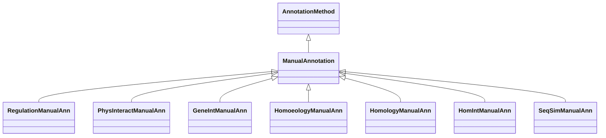

# Class: Manual Annotation (ManualAnnotation) 


_An association that represents a manual annotation, provided by a curator or expert._

__


* __NOTE__: this is an abstract class and should not be instantiated directly


URI: [motif:ManualAnnotation](https://knetminer.com/terms/motifs/motif-categories/ManualAnnotation)





## Inheritance
* [SemanticMotifCategory](SemanticMotifCategory.md)
    * [AnnotationMethod](AnnotationMethod.md)
        * **ManualAnnotation**


## Slots

| Name | Cardinality and Range | Description | Inheritance |
| ---  | --- | --- | --- |


## Mixin Usage

| mixed into | description |
| --- | --- |
| [RegulationManualAnn](RegulationManualAnn.md) | An association that represents a manual annotation based on gene expression r... |
| [PhysInteractManualAnn](PhysInteractManualAnn.md) | An association that represents a manual annotation based on physical interact... |
| [GeneIntManualAnn](GeneIntManualAnn.md) | An association that represents a manual annotation based on gene-gene interac... |
| [HomoeologyManualAnn](HomoeologyManualAnn.md) | An association that represents a manual annotation based on homoeology |
| [HomologyManualAnn](HomologyManualAnn.md) | An association that represents a manual annotation based on homology |
| [HomIntManualAnn](HomIntManualAnn.md) | An association that represents a manual annotation based on homology interact... |
| [SeqSimManualAnn](SeqSimManualAnn.md) | An association that represents a manual annotation based on sequence similari... |


## Identifier and Mapping Information


### Schema Source


* from schema: https://knetminer.com/terms/motifs/motif-categories/schema


## Mappings

| Mapping Type | Mapped Value |
| ---  | ---  |
| self | motif:ManualAnnotation |
| native | motif:ManualAnnotation |


## LinkML Source

<!-- TODO: investigate https://stackoverflow.com/questions/37606292/how-to-create-tabbed-code-blocks-in-mkdocs-or-sphinx -->

### Direct

<details>
```yaml
name: ManualAnnotation
description: 'An association that represents a manual annotation, provided by a curator
  or expert.

  '
title: Manual Annotation
from_schema: https://knetminer.com/terms/motifs/motif-categories/schema
is_a: AnnotationMethod
abstract: true
mixin: true

```
</details>

### Induced

<details>
```yaml
name: ManualAnnotation
description: 'An association that represents a manual annotation, provided by a curator
  or expert.

  '
title: Manual Annotation
from_schema: https://knetminer.com/terms/motifs/motif-categories/schema
is_a: AnnotationMethod
abstract: true
mixin: true

```
</details>