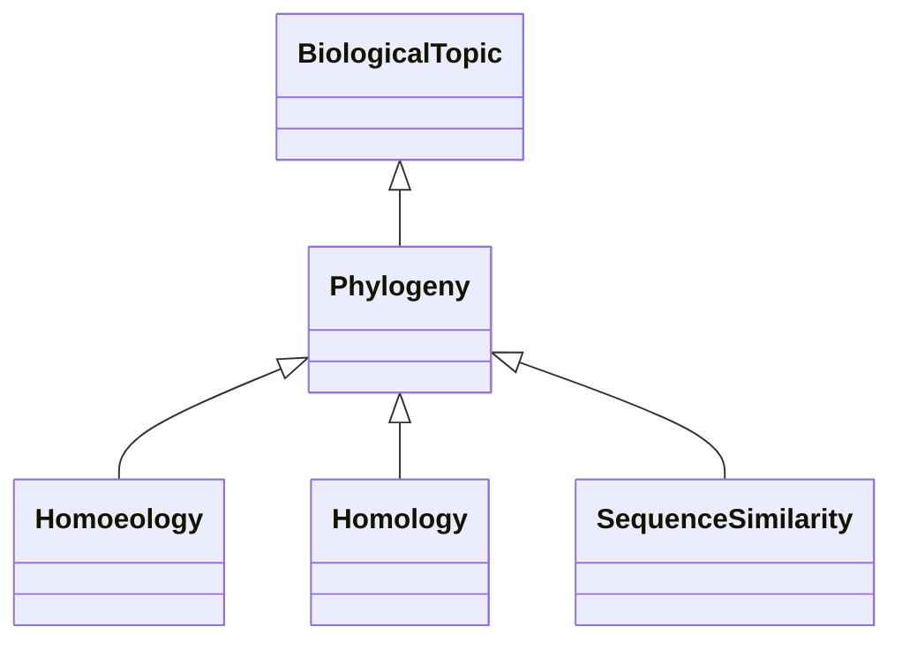

# Class: Phylogeny-related Association (Phylogeny) 


_Associations of this type are related to phylogenetic relationships, such as homoeology, homology_

_or other evolutionary relationships between genes or species._

__


* __NOTE__: this is an abstract class and should not be instantiated directly


URI: [motif:Phylogeny](https://knetminer.com/terms/motifs/motif-categories/Phylogeny)





## Inheritance
* [SemanticMotifCategory](SemanticMotifCategory.md)
    * [BiologicalTopic](BiologicalTopic.md)
        * **Phylogeny**
            * [Homoeology](Homoeology.md) [ [IntraSpeciesAssociation](IntraSpeciesAssociation.md)]
            * [Homology](Homology.md) [ [CrossSpeciesAssociation](CrossSpeciesAssociation.md)]
            * [SequenceSimilarity](SequenceSimilarity.md) [ [AssociationStrength](AssociationStrength.md)]


## Slots

| Name | Cardinality and Range | Description | Inheritance |
| ---  | --- | --- | --- |


## Identifier and Mapping Information


### Schema Source


* from schema: https://knetminer.com/terms/motifs/motif-categories/schema


## Mappings

| Mapping Type | Mapped Value |
| ---  | ---  |
| self | motif:Phylogeny |
| native | motif:Phylogeny |


## LinkML Source

<!-- TODO: investigate https://stackoverflow.com/questions/37606292/how-to-create-tabbed-code-blocks-in-mkdocs-or-sphinx -->

### Direct

<details>
```yaml
name: Phylogeny
description: 'Associations of this type are related to phylogenetic relationships,
  such as homoeology, homology

  or other evolutionary relationships between genes or species.

  '
title: Phylogeny-related Association
from_schema: https://knetminer.com/terms/motifs/motif-categories/schema
is_a: BiologicalTopic
abstract: true

```
</details>

### Induced

<details>
```yaml
name: Phylogeny
description: 'Associations of this type are related to phylogenetic relationships,
  such as homoeology, homology

  or other evolutionary relationships between genes or species.

  '
title: Phylogeny-related Association
from_schema: https://knetminer.com/terms/motifs/motif-categories/schema
is_a: BiologicalTopic
abstract: true

```
</details>