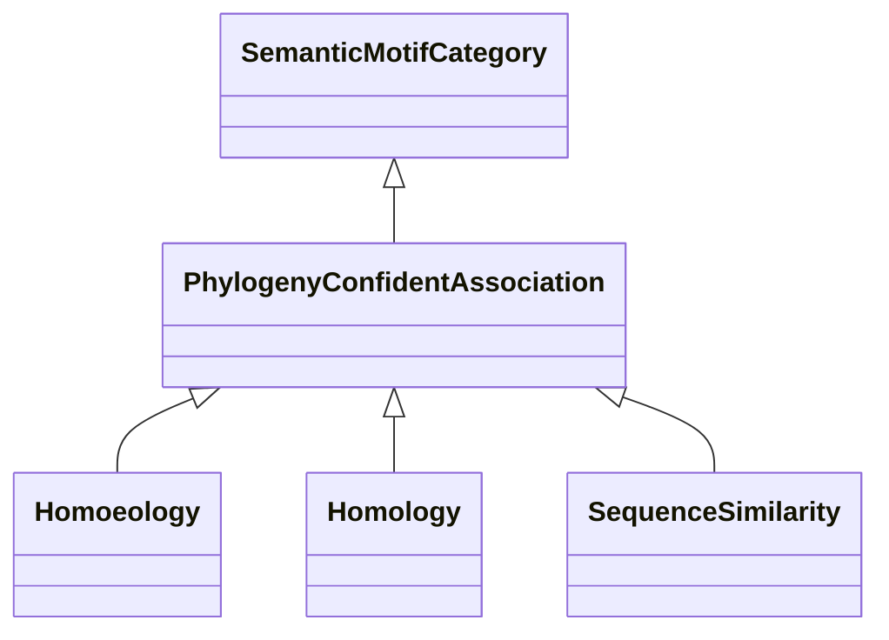

# Class: Sequence-Based (PhylogenyConfidentAssociation) 


_This category includes confident associations based on phylogenetic relationships, _

_such as homoeology, homology, or other evolutionary links between genes or species._

__

_The Homology Interaction category is excluded, as those associations are cross-species _

_and considered speculative._

__


URI: [motif:PhylogenyConfidentAssociation](https://knetminer.com/terms/motifs/motif-categories/PhylogenyConfidentAssociation)





## Inheritance
* [SemanticMotifCategory](SemanticMotifCategory.md)
    * **PhylogenyConfidentAssociation**
        * [Homoeology](Homoeology.md) [ [IntraSpeciesAssociation](IntraSpeciesAssociation.md)]
        * [Homology](Homology.md) [ [CrossSpeciesAssociation](CrossSpeciesAssociation.md)]
        * [SequenceSimilarity](SequenceSimilarity.md)


## Slots

| Name | Cardinality and Range | Description | Inheritance |
| ---  | --- | --- | --- |


## Identifier and Mapping Information


### Schema Source


* from schema: https://knetminer.com/terms/motifs/motif-categories/schema


## Mappings

| Mapping Type | Mapped Value |
| ---  | ---  |
| self | motif:PhylogenyConfidentAssociation |
| native | motif:PhylogenyConfidentAssociation |


## LinkML Source

<!-- TODO: investigate https://stackoverflow.com/questions/37606292/how-to-create-tabbed-code-blocks-in-mkdocs-or-sphinx -->

### Direct

<details>
```yaml
name: PhylogenyConfidentAssociation
description: "This category includes confident associations based on phylogenetic\
  \ relationships, \nsuch as homoeology, homology, or other evolutionary links between\
  \ genes or species.\n\nThe Homology Interaction category is excluded, as those associations\
  \ are cross-species \nand considered speculative.\n"
title: Sequence-Based
from_schema: https://knetminer.com/terms/motifs/motif-categories/schema
is_a: SemanticMotifCategory

```
</details>

### Induced

<details>
```yaml
name: PhylogenyConfidentAssociation
description: "This category includes confident associations based on phylogenetic\
  \ relationships, \nsuch as homoeology, homology, or other evolutionary links between\
  \ genes or species.\n\nThe Homology Interaction category is excluded, as those associations\
  \ are cross-species \nand considered speculative.\n"
title: Sequence-Based
from_schema: https://knetminer.com/terms/motifs/motif-categories/schema
is_a: SemanticMotifCategory

```
</details>