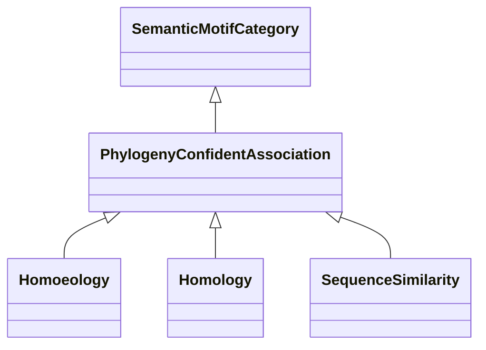

# Class: Sequence-Based (PhylogenyConfidentAssociation) 


_Associations in this category are considered to have good confidence and are related to _

_phylogenetic relationships, such as homoeology, homology or other evolutionary _

_relationships between genes or species._

__

_The Homology Interaction category is excluded from this branch, since those kind of _

_associations are based on cross-species similarity and considered speculative. _

__


URI: [motif:PhylogenyConfidentAssociation](https://knetminer.com/terms/motifs/motif-categories/PhylogenyConfidentAssociation)





## Inheritance
* [SemanticMotifCategory](SemanticMotifCategory.md)
    * **PhylogenyConfidentAssociation**
        * [Homoeology](Homoeology.md) [ [IntraSpeciesAssociation](IntraSpeciesAssociation.md)]
        * [Homology](Homology.md) [ [CrossSpeciesAssociation](CrossSpeciesAssociation.md)]
        * [SequenceSimilarity](SequenceSimilarity.md)


## Slots

| Name | Cardinality and Range | Description | Inheritance |
| ---  | --- | --- | --- |


## Identifier and Mapping Information


### Schema Source


* from schema: https://knetminer.com/terms/motifs/motif-categories/schema


## Mappings

| Mapping Type | Mapped Value |
| ---  | ---  |
| self | motif:PhylogenyConfidentAssociation |
| native | motif:PhylogenyConfidentAssociation |


## LinkML Source

<!-- TODO: investigate https://stackoverflow.com/questions/37606292/how-to-create-tabbed-code-blocks-in-mkdocs-or-sphinx -->

### Direct

<details>
```yaml
name: PhylogenyConfidentAssociation
description: "Associations in this category are considered to have good confidence\
  \ and are related to \nphylogenetic relationships, such as homoeology, homology\
  \ or other evolutionary \nrelationships between genes or species.\n\nThe Homology\
  \ Interaction category is excluded from this branch, since those kind of \nassociations\
  \ are based on cross-species similarity and considered speculative. \n"
title: Sequence-Based
from_schema: https://knetminer.com/terms/motifs/motif-categories/schema
is_a: SemanticMotifCategory

```
</details>

### Induced

<details>
```yaml
name: PhylogenyConfidentAssociation
description: "Associations in this category are considered to have good confidence\
  \ and are related to \nphylogenetic relationships, such as homoeology, homology\
  \ or other evolutionary \nrelationships between genes or species.\n\nThe Homology\
  \ Interaction category is excluded from this branch, since those kind of \nassociations\
  \ are based on cross-species similarity and considered speculative. \n"
title: Sequence-Based
from_schema: https://knetminer.com/terms/motifs/motif-categories/schema
is_a: SemanticMotifCategory

```
</details>