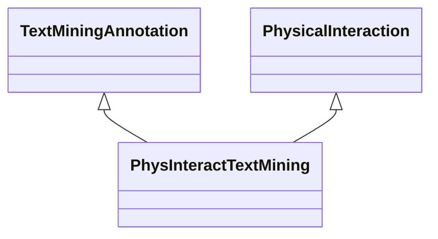

# Class: Text Mining Annotation about Physical Interaction (PhysInteractTextMining) 


_An association that represents a text mining annotation based on physical interaction._

__


URI: [motif:PhysInteractTextMining](https://knetminer.com/terms/motifs/motif-categories/PhysInteractTextMining)





## Inheritance
* [SemanticMotifCategory](SemanticMotifCategory.md)
    * [BiologicalTopic](BiologicalTopic.md)
        * [PhysicalInteraction](PhysicalInteraction.md)
            * **PhysInteractTextMining** [ [TextMiningAnnotation](TextMiningAnnotation.md)]


## Slots

| Name | Cardinality and Range | Description | Inheritance |
| ---  | --- | --- | --- |


## Identifier and Mapping Information


### Schema Source


* from schema: https://knetminer.com/terms/motifs/motif-categories/schema


## Mappings

| Mapping Type | Mapped Value |
| ---  | ---  |
| self | motif:PhysInteractTextMining |
| native | motif:PhysInteractTextMining |


## LinkML Source

<!-- TODO: investigate https://stackoverflow.com/questions/37606292/how-to-create-tabbed-code-blocks-in-mkdocs-or-sphinx -->

### Direct

<details>
```yaml
name: PhysInteractTextMining
description: 'An association that represents a text mining annotation based on physical
  interaction.

  '
title: Text Mining Annotation about Physical Interaction
notes:
- 'original category: 2.8'
from_schema: https://knetminer.com/terms/motifs/motif-categories/schema
is_a: PhysicalInteraction
mixins:
- TextMiningAnnotation

```
</details>

### Induced

<details>
```yaml
name: PhysInteractTextMining
description: 'An association that represents a text mining annotation based on physical
  interaction.

  '
title: Text Mining Annotation about Physical Interaction
notes:
- 'original category: 2.8'
from_schema: https://knetminer.com/terms/motifs/motif-categories/schema
is_a: PhysicalInteraction
mixins:
- TextMiningAnnotation

```
</details>