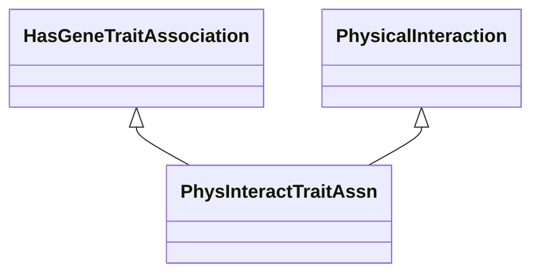

# Class: Physical Interaction Trait (PhysInteractTraitAssn) 


_A gene-to-trait association based on physical interaction._

__


URI: [motif:PhysInteractTraitAssn](https://knetminer.com/terms/motifs/motif-categories/PhysInteractTraitAssn)





## Inheritance
* [SemanticMotifCategory](SemanticMotifCategory.md)
    * [BioMolecularInteraction](BioMolecularInteraction.md)
        * [PhysicalInteraction](PhysicalInteraction.md)
            * **PhysInteractTraitAssn** [ [HasGeneTraitAssociation](HasGeneTraitAssociation.md)]


## Slots

| Name | Cardinality and Range | Description | Inheritance |
| ---  | --- | --- | --- |


## Identifier and Mapping Information


### Annotations

| property | value |
| --- | --- |
| originalCategory | interaction::physical::genetics |


### Schema Source


* from schema: https://knetminer.com/terms/motifs/motif-categories/schema


## Mappings

| Mapping Type | Mapped Value |
| ---  | ---  |
| self | motif:PhysInteractTraitAssn |
| native | motif:PhysInteractTraitAssn |


## LinkML Source

<!-- TODO: investigate https://stackoverflow.com/questions/37606292/how-to-create-tabbed-code-blocks-in-mkdocs-or-sphinx -->

### Direct

<details>
```yaml
name: PhysInteractTraitAssn
annotations:
  originalCategory:
    tag: originalCategory
    value: interaction::physical::genetics
description: 'A gene-to-trait association based on physical interaction.

  '
title: Physical Interaction Trait
notes:
- 'original category no: 2.7'
from_schema: https://knetminer.com/terms/motifs/motif-categories/schema
is_a: PhysicalInteraction
mixins:
- HasGeneTraitAssociation

```
</details>

### Induced

<details>
```yaml
name: PhysInteractTraitAssn
annotations:
  originalCategory:
    tag: originalCategory
    value: interaction::physical::genetics
description: 'A gene-to-trait association based on physical interaction.

  '
title: Physical Interaction Trait
notes:
- 'original category no: 2.7'
from_schema: https://knetminer.com/terms/motifs/motif-categories/schema
is_a: PhysicalInteraction
mixins:
- HasGeneTraitAssociation

```
</details>