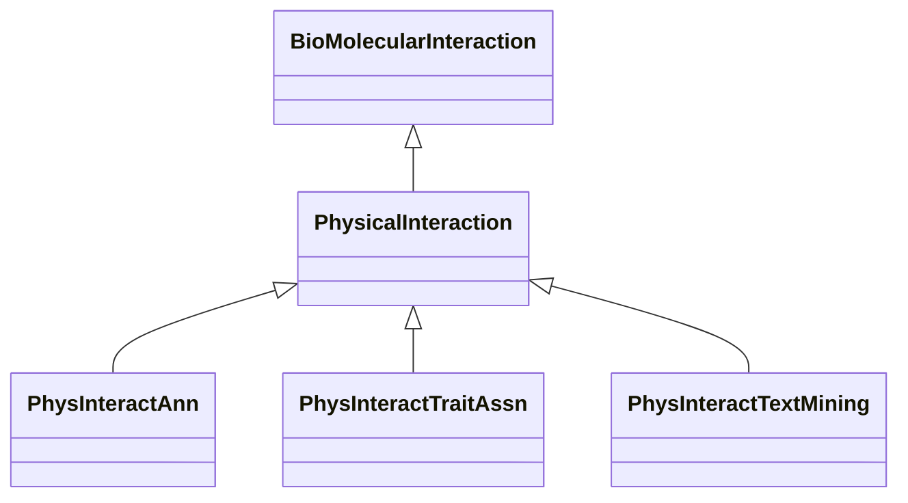

# Class: Physical Bio-Molecular Interaction (PhysicalInteraction) 


_Associations of this type are related to physical interactions between genes, proteins or other _

_biomolecular entities._

__


* __NOTE__: this is an abstract class and should not be instantiated directly


URI: [motif:PhysicalInteraction](https://knetminer.com/terms/motifs/motif-categories/PhysicalInteraction)





## Inheritance
* [SemanticMotifCategory](SemanticMotifCategory.md)
    * [BioMolecularInteraction](BioMolecularInteraction.md)
        * **PhysicalInteraction**
            * [PhysInteractAnn](PhysInteractAnn.md) [ [HasCuratedAnnotation](HasCuratedAnnotation.md)]
            * [PhysInteractTraitAssn](PhysInteractTraitAssn.md) [ [HasGeneTraitAssociation](HasGeneTraitAssociation.md)]
            * [PhysInteractTextMining](PhysInteractTextMining.md) [ [HasTextMiningAnnotation](HasTextMiningAnnotation.md)]


## Slots

| Name | Cardinality and Range | Description | Inheritance |
| ---  | --- | --- | --- |


## Identifier and Mapping Information


### Schema Source


* from schema: https://knetminer.com/terms/motifs/motif-categories/schema


## Mappings

| Mapping Type | Mapped Value |
| ---  | ---  |
| self | motif:PhysicalInteraction |
| native | motif:PhysicalInteraction |


## LinkML Source

<!-- TODO: investigate https://stackoverflow.com/questions/37606292/how-to-create-tabbed-code-blocks-in-mkdocs-or-sphinx -->

### Direct

<details>
```yaml
name: PhysicalInteraction
description: "Associations of this type are related to physical interactions between\
  \ genes, proteins or other \nbiomolecular entities.\n"
title: Physical Bio-Molecular Interaction
from_schema: https://knetminer.com/terms/motifs/motif-categories/schema
is_a: BioMolecularInteraction
abstract: true

```
</details>

### Induced

<details>
```yaml
name: PhysicalInteraction
description: "Associations of this type are related to physical interactions between\
  \ genes, proteins or other \nbiomolecular entities.\n"
title: Physical Bio-Molecular Interaction
from_schema: https://knetminer.com/terms/motifs/motif-categories/schema
is_a: BioMolecularInteraction
abstract: true

```
</details>