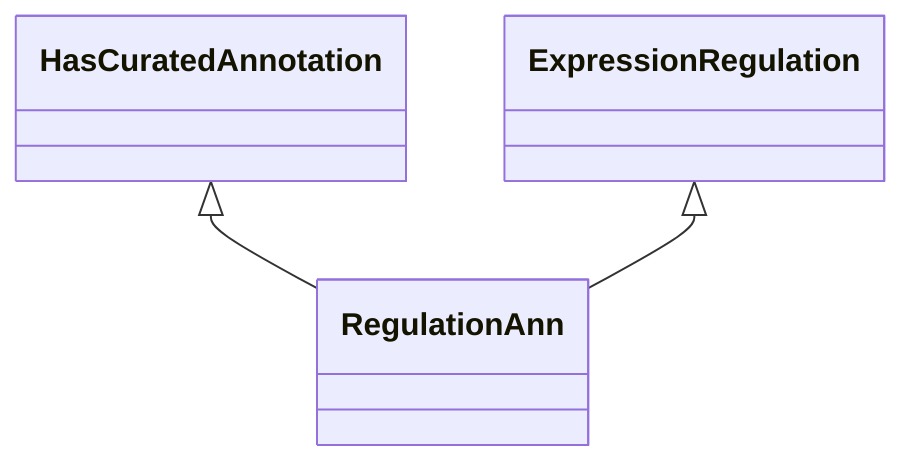

# Class: Expression Regulation Annotation (RegulationAnn) 


_A curated annotation based on gene expression regulation. _

__


URI: [motif:RegulationAnn](https://knetminer.com/terms/motifs/motif-categories/RegulationAnn)





## Inheritance
* [SemanticMotifCategory](SemanticMotifCategory.md)
    * [GeneExpression](GeneExpression.md) [ [IntraSpeciesAssociation](IntraSpeciesAssociation.md)]
        * [ExpressionRegulation](ExpressionRegulation.md)
            * **RegulationAnn** [ [HasCuratedAnnotation](HasCuratedAnnotation.md)]


## Slots

| Name | Cardinality and Range | Description | Inheritance |
| ---  | --- | --- | --- |


## Identifier and Mapping Information


### Annotations

| property | value |
| --- | --- |
| originalCategory | expression::regulation::annotation |


### Schema Source


* from schema: https://knetminer.com/terms/motifs/motif-categories/schema


## Mappings

| Mapping Type | Mapped Value |
| ---  | ---  |
| self | motif:RegulationAnn |
| native | motif:RegulationAnn |


## LinkML Source

<!-- TODO: investigate https://stackoverflow.com/questions/37606292/how-to-create-tabbed-code-blocks-in-mkdocs-or-sphinx -->

### Direct

<details>
```yaml
name: RegulationAnn
annotations:
  originalCategory:
    tag: originalCategory
    value: expression::regulation::annotation
description: "A curated annotation based on gene expression regulation. \n"
title: Expression Regulation Annotation
notes:
- 'original category no: 2.3'
from_schema: https://knetminer.com/terms/motifs/motif-categories/schema
is_a: ExpressionRegulation
mixins:
- HasCuratedAnnotation

```
</details>

### Induced

<details>
```yaml
name: RegulationAnn
annotations:
  originalCategory:
    tag: originalCategory
    value: expression::regulation::annotation
description: "A curated annotation based on gene expression regulation. \n"
title: Expression Regulation Annotation
notes:
- 'original category no: 2.3'
from_schema: https://knetminer.com/terms/motifs/motif-categories/schema
is_a: ExpressionRegulation
mixins:
- HasCuratedAnnotation

```
</details>