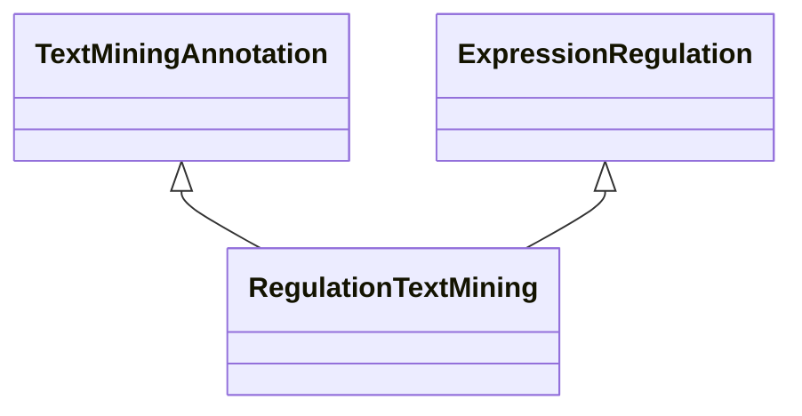

# Class: Text Mining Annotation about Gene Expression Regulation (RegulationTextMining) 


_An association that represents a text mining annotation based on gene expression regulation._

__


URI: [motif:RegulationTextMining](https://knetminer.com/terms/motifs/motif-categories/RegulationTextMining)





## Inheritance
* [SemanticMotifCategory](SemanticMotifCategory.md)
    * [BiologicalTopic](BiologicalTopic.md)
        * [GeneExpression](GeneExpression.md) [ [IntraSpecieAssociation](IntraSpecieAssociation.md)]
            * [ExpressionRegulation](ExpressionRegulation.md)
                * **RegulationTextMining** [ [TextMiningAnnotation](TextMiningAnnotation.md)]


## Slots

| Name | Cardinality and Range | Description | Inheritance |
| ---  | --- | --- | --- |


## Identifier and Mapping Information


### Annotations

| property | value |
| --- | --- |
| associationStrength | 2.1 |
| originalCategory | expression::regulation::literature |


### Schema Source


* from schema: https://knetminer.com/terms/motifs/motif-categories/schema


## Mappings

| Mapping Type | Mapped Value |
| ---  | ---  |
| self | motif:RegulationTextMining |
| native | motif:RegulationTextMining |


## LinkML Source

<!-- TODO: investigate https://stackoverflow.com/questions/37606292/how-to-create-tabbed-code-blocks-in-mkdocs-or-sphinx -->

### Direct

<details>
```yaml
name: RegulationTextMining
annotations:
  associationStrength:
    tag: associationStrength
    value: 2.1
  originalCategory:
    tag: originalCategory
    value: expression::regulation::literature
description: 'An association that represents a text mining annotation based on gene
  expression regulation.

  '
title: Text Mining Annotation about Gene Expression Regulation
notes:
- 'original category no: 2.5'
from_schema: https://knetminer.com/terms/motifs/motif-categories/schema
is_a: ExpressionRegulation
mixins:
- TextMiningAnnotation

```
</details>

### Induced

<details>
```yaml
name: RegulationTextMining
annotations:
  associationStrength:
    tag: associationStrength
    value: 2.1
  originalCategory:
    tag: originalCategory
    value: expression::regulation::literature
description: 'An association that represents a text mining annotation based on gene
  expression regulation.

  '
title: Text Mining Annotation about Gene Expression Regulation
notes:
- 'original category no: 2.5'
from_schema: https://knetminer.com/terms/motifs/motif-categories/schema
is_a: ExpressionRegulation
mixins:
- TextMiningAnnotation

```
</details>