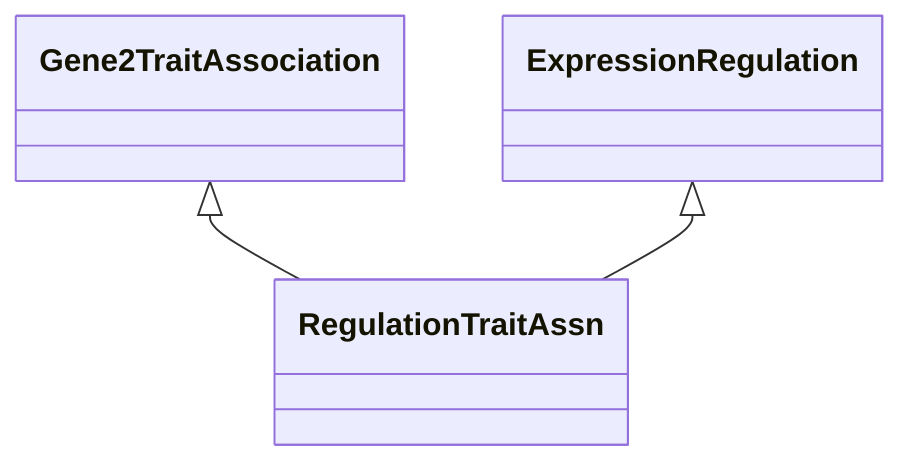

# Class: Gene-to-Trait Association via Gene Expression Regulation (RegulationTraitAssn) 


_A gene-to-trait association based on gene expression regulation._

__


URI: [motif:RegulationTraitAssn](https://knetminer.com/terms/motifs/motif-categories/RegulationTraitAssn)





## Inheritance
* [SemanticMotifCategory](SemanticMotifCategory.md)
    * [BiologicalTopic](BiologicalTopic.md)
        * [GeneExpression](GeneExpression.md) [ [IntraSpecieAssociation](IntraSpecieAssociation.md)]
            * [ExpressionRegulation](ExpressionRegulation.md)
                * **RegulationTraitAssn** [ [Gene2TraitAssociation](Gene2TraitAssociation.md)]


## Slots

| Name | Cardinality and Range | Description | Inheritance |
| ---  | --- | --- | --- |


## Identifier and Mapping Information


### Schema Source


* from schema: https://knetminer.com/terms/motifs/motif-categories/schema


## Mappings

| Mapping Type | Mapped Value |
| ---  | ---  |
| self | motif:RegulationTraitAssn |
| native | motif:RegulationTraitAssn |


## LinkML Source

<!-- TODO: investigate https://stackoverflow.com/questions/37606292/how-to-create-tabbed-code-blocks-in-mkdocs-or-sphinx -->

### Direct

<details>
```yaml
name: RegulationTraitAssn
description: 'A gene-to-trait association based on gene expression regulation.

  '
title: Gene-to-Trait Association via Gene Expression Regulation
notes:
- 'original category: 2.4'
from_schema: https://knetminer.com/terms/motifs/motif-categories/schema
is_a: ExpressionRegulation
mixins:
- Gene2TraitAssociation

```
</details>

### Induced

<details>
```yaml
name: RegulationTraitAssn
description: 'A gene-to-trait association based on gene expression regulation.

  '
title: Gene-to-Trait Association via Gene Expression Regulation
notes:
- 'original category: 2.4'
from_schema: https://knetminer.com/terms/motifs/motif-categories/schema
is_a: ExpressionRegulation
mixins:
- Gene2TraitAssociation

```
</details>