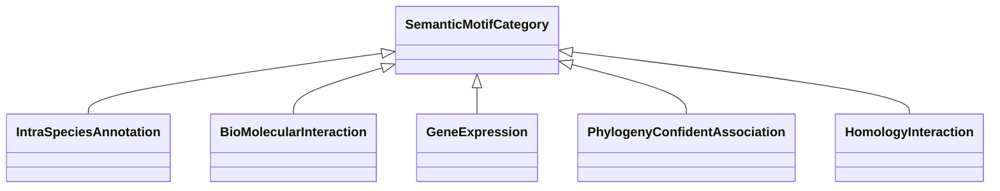

# Class: Semantic Motif Category (SemanticMotifCategory) 


_Root class/container, all the motif categories are subclasses of this._

__


* __NOTE__: this is an abstract class and should not be instantiated directly


URI: [motif:SemanticMotifCategory](https://knetminer.com/terms/motifs/motif-categories/SemanticMotifCategory)





## Inheritance
* **SemanticMotifCategory**
    * [IntraSpeciesAnnotation](IntraSpeciesAnnotation.md) [ [IntraSpeciesAssociation](IntraSpeciesAssociation.md)]
    * [BioMolecularInteraction](BioMolecularInteraction.md)
    * [GeneExpression](GeneExpression.md) [ [IntraSpeciesAssociation](IntraSpeciesAssociation.md)]
    * [PhylogenyConfidentAssociation](PhylogenyConfidentAssociation.md)
    * [HomologyInteraction](HomologyInteraction.md)


## Slots

| Name | Cardinality and Range | Description | Inheritance |
| ---  | --- | --- | --- |


## Identifier and Mapping Information


### Schema Source


* from schema: https://knetminer.com/terms/motifs/motif-categories/schema


## Mappings

| Mapping Type | Mapped Value |
| ---  | ---  |
| self | motif:SemanticMotifCategory |
| native | motif:SemanticMotifCategory |


## LinkML Source

<!-- TODO: investigate https://stackoverflow.com/questions/37606292/how-to-create-tabbed-code-blocks-in-mkdocs-or-sphinx -->

### Direct

<details>
```yaml
name: SemanticMotifCategory
description: 'Root class/container, all the motif categories are subclasses of this.

  '
title: Semantic Motif Category
from_schema: https://knetminer.com/terms/motifs/motif-categories/schema
abstract: true

```
</details>

### Induced

<details>
```yaml
name: SemanticMotifCategory
description: 'Root class/container, all the motif categories are subclasses of this.

  '
title: Semantic Motif Category
from_schema: https://knetminer.com/terms/motifs/motif-categories/schema
abstract: true

```
</details>