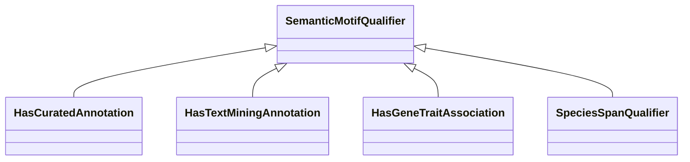

# Class: Association Qualifier (SemanticMotifQualifier) 


_This branch contains mix-ins that are used to qualify semantic motif categories with aspects_

_like the fact a category contains a curated annotation or it's intra/cross species._

__


* __NOTE__: this is an abstract class and should not be instantiated directly


URI: [motif:SemanticMotifQualifier](https://knetminer.com/terms/motifs/motif-categories/SemanticMotifQualifier)





## Inheritance
* **SemanticMotifQualifier**
    * [HasCuratedAnnotation](HasCuratedAnnotation.md)
    * [HasTextMiningAnnotation](HasTextMiningAnnotation.md)
    * [HasGeneTraitAssociation](HasGeneTraitAssociation.md)
    * [SpeciesSpanQualifier](SpeciesSpanQualifier.md)


## Slots

| Name | Cardinality and Range | Description | Inheritance |
| ---  | --- | --- | --- |


## Mixin Usage

| mixed into | description |
| --- | --- |


## Identifier and Mapping Information


### Schema Source


* from schema: https://knetminer.com/terms/motifs/motif-categories/schema


## Mappings

| Mapping Type | Mapped Value |
| ---  | ---  |
| self | motif:SemanticMotifQualifier |
| native | motif:SemanticMotifQualifier |


## LinkML Source

<!-- TODO: investigate https://stackoverflow.com/questions/37606292/how-to-create-tabbed-code-blocks-in-mkdocs-or-sphinx -->

### Direct

<details>
```yaml
name: SemanticMotifQualifier
description: 'This branch contains mix-ins that are used to qualify semantic motif
  categories with aspects

  like the fact a category contains a curated annotation or it''s intra/cross species.

  '
title: Association Qualifier
from_schema: https://knetminer.com/terms/motifs/motif-categories/schema
abstract: true
mixin: true

```
</details>

### Induced

<details>
```yaml
name: SemanticMotifQualifier
description: 'This branch contains mix-ins that are used to qualify semantic motif
  categories with aspects

  like the fact a category contains a curated annotation or it''s intra/cross species.

  '
title: Association Qualifier
from_schema: https://knetminer.com/terms/motifs/motif-categories/schema
abstract: true
mixin: true

```
</details>