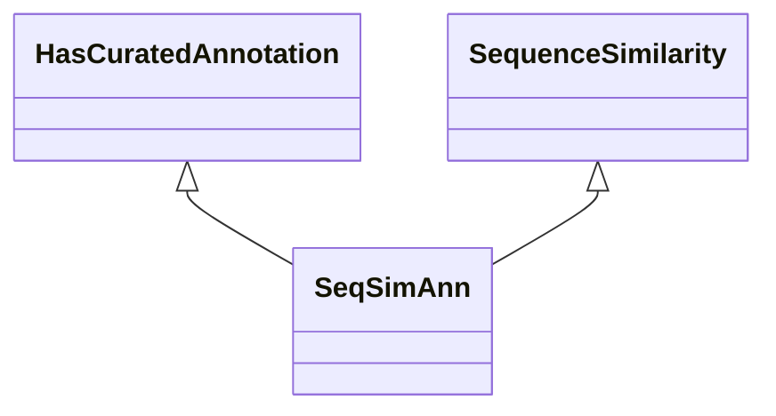

# Class: Sequence Similarity Annotation (SeqSimAnn) 


_An association that represents a manual annotation based on sequence similarity._

__


URI: [motif:SeqSimAnn](https://knetminer.com/terms/motifs/motif-categories/SeqSimAnn)





## Inheritance
* [SemanticMotifCategory](SemanticMotifCategory.md)
    * [PhylogenyConfidentAssociation](PhylogenyConfidentAssociation.md)
        * [SequenceSimilarity](SequenceSimilarity.md)
            * **SeqSimAnn** [ [HasCuratedAnnotation](HasCuratedAnnotation.md)]


## Slots

| Name | Cardinality and Range | Description | Inheritance |
| ---  | --- | --- | --- |


## Identifier and Mapping Information


### Annotations

| property | value |
| --- | --- |
| originalCategory | phylogeny::similarity::annotation |


### Schema Source


* from schema: https://knetminer.com/terms/motifs/motif-categories/schema


## Mappings

| Mapping Type | Mapped Value |
| ---  | ---  |
| self | motif:SeqSimAnn |
| native | motif:SeqSimAnn |


## LinkML Source

<!-- TODO: investigate https://stackoverflow.com/questions/37606292/how-to-create-tabbed-code-blocks-in-mkdocs-or-sphinx -->

### Direct

<details>
```yaml
name: SeqSimAnn
annotations:
  originalCategory:
    tag: originalCategory
    value: phylogeny::similarity::annotation
description: 'An association that represents a manual annotation based on sequence
  similarity.

  '
title: Sequence Similarity Annotation
notes:
- 'original category no: 4.1'
from_schema: https://knetminer.com/terms/motifs/motif-categories/schema
is_a: SequenceSimilarity
mixins:
- HasCuratedAnnotation

```
</details>

### Induced

<details>
```yaml
name: SeqSimAnn
annotations:
  originalCategory:
    tag: originalCategory
    value: phylogeny::similarity::annotation
description: 'An association that represents a manual annotation based on sequence
  similarity.

  '
title: Sequence Similarity Annotation
notes:
- 'original category no: 4.1'
from_schema: https://knetminer.com/terms/motifs/motif-categories/schema
is_a: SequenceSimilarity
mixins:
- HasCuratedAnnotation

```
</details>