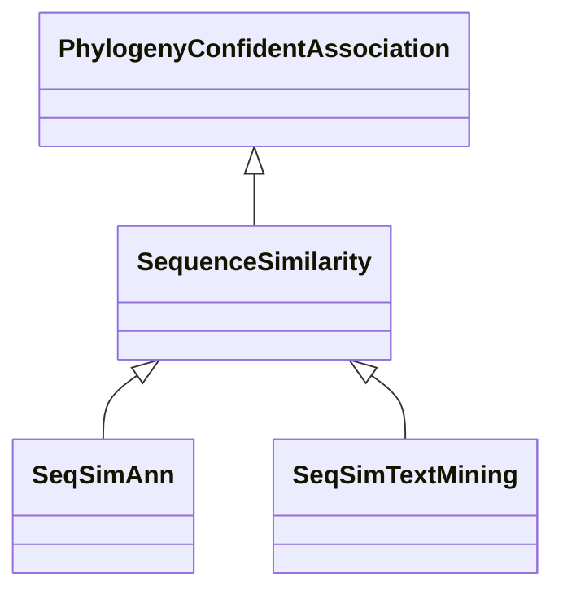

# Class: Sequence Similarity (SequenceSimilarity) 


_Associations of this type are more speculative than homoeology or homology, since sequence similarity_

_does not guarantee a shared evolutionary origin or function._

__


* __NOTE__: this is an abstract class and should not be instantiated directly


URI: [motif:SequenceSimilarity](https://knetminer.com/terms/motifs/motif-categories/SequenceSimilarity)





## Inheritance
* [SemanticMotifCategory](SemanticMotifCategory.md)
    * [PhylogenyConfidentAssociation](PhylogenyConfidentAssociation.md)
        * **SequenceSimilarity**
            * [SeqSimAnn](SeqSimAnn.md) [ [HasCuratedAnnotation](HasCuratedAnnotation.md)]
            * [SeqSimTextMining](SeqSimTextMining.md) [ [HasTextMiningAnnotation](HasTextMiningAnnotation.md)]


## Slots

| Name | Cardinality and Range | Description | Inheritance |
| ---  | --- | --- | --- |


## Identifier and Mapping Information


### Schema Source


* from schema: https://knetminer.com/terms/motifs/motif-categories/schema


## Mappings

| Mapping Type | Mapped Value |
| ---  | ---  |
| self | motif:SequenceSimilarity |
| native | motif:SequenceSimilarity |


## LinkML Source

<!-- TODO: investigate https://stackoverflow.com/questions/37606292/how-to-create-tabbed-code-blocks-in-mkdocs-or-sphinx -->

### Direct

<details>
```yaml
name: SequenceSimilarity
description: 'Associations of this type are more speculative than homoeology or homology,
  since sequence similarity

  does not guarantee a shared evolutionary origin or function.

  '
title: Sequence Similarity
notes:
- 'original category no: Tier 4'
from_schema: https://knetminer.com/terms/motifs/motif-categories/schema
is_a: PhylogenyConfidentAssociation
abstract: true

```
</details>

### Induced

<details>
```yaml
name: SequenceSimilarity
description: 'Associations of this type are more speculative than homoeology or homology,
  since sequence similarity

  does not guarantee a shared evolutionary origin or function.

  '
title: Sequence Similarity
notes:
- 'original category no: Tier 4'
from_schema: https://knetminer.com/terms/motifs/motif-categories/schema
is_a: PhylogenyConfidentAssociation
abstract: true

```
</details>